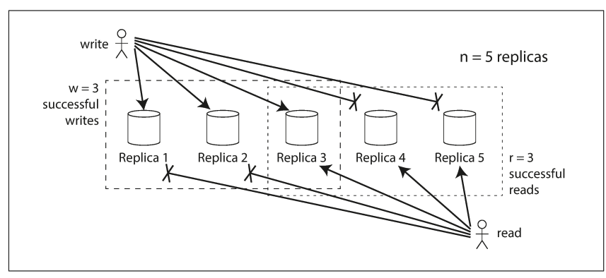

**Catalog**

1. [Storage and Retrieval](#storage-and-retrieval)
    - [Storing values within the index](#storing-values-within-the-index)
    - [Multi-column indexes](#multicolumn-indexes)
    - [fuzzy indexes](#fuzzy-indexes)
    - [in-memory databases](#inmemory-databases)
    - [Column-Oriented Storage](#columnoriented-storage)
    - [Map reduce](#map-reduce)
    - [Graph db](#graph-db)
    - [So sánh cơ sở dữ liệu đồ thị với mô hình mạng](#so-sánh-c-s-d-liu--th-vi-mô-hình-mng)
2. [Encoding and Evolution](#encoding-and-evolution)
    - [Formats for Encoding Data](#formats-for-encoding-data)
    - [Thrift and Protocol Buffers](#thrift-and-protocol-buffers)
    - [Avro](#avro)
    - [Dataflow Through Databases](#dataflow-through-databases)
    - [Dataflow Through Services: REST and RPC](#dataflow-through-services-rest-and-rpc)
    - [Message-Passing Dataflow](#messagepassing-dataflow)
3. [Replication](#replication)
    - [Leader & Follower](#leader--follower)
    - [Replication Logs](#replication-logs)
    - [row-based](#rowbased)
    - [Replication lag](#replication-lag)
    - [Multi-Leader Replication](#multileader-replication)
    - [Leaderless Replication](#leaderless-replication)

---

# Storage and Retrieval

## Storing values within the index

- Khóa trong chỉ mục là thứ mà truy vấn tìm kiếm, nhưng giá trị có thể là một trong hai dạng: 
    - hoặc là toàn bộ dòng dữ liệu (tài liệu, đỉnh)
    - hoặc là tham chiếu đến dòng được lưu trữ ở nơi khác
    - Trường hợp thứ hai, nơi lưu trữ các dòng được gọi là "heap file": lưu dữ liệu không theo thứ tự cụ thể nào
    - Cách tiếp cận heap file khá phổ biến vì nó tránh việc trùng lặp dữ liệu khi có nhiều chỉ mục phụ: mỗi chỉ mục chỉ cần tham chiếu đến vị trí trong heap, còn dữ liệu thực được lưu một chỗ duy nhất.
- Khi cập nhật giá trị mà không thay đổi khóa, phương pháp heap file khá hiệu quả
    - Chỉ cần ghi đè bản ghi tại chỗ nếu giá trị mới không dài hơn giá trị cũ(size of mem)
    - Nhưng nếu giá trị mới dài hơn, có thể cần chuyển bản ghi sang một vị trí mới trong heap có đủ chỗ.
        - hoặc là tất cả chỉ mục cần được cập nhật để trỏ đến vị trí mới
        - hoặc là để lại một con trỏ chuyển tiếp ở vị trí cũ.
    - bước truy cập gián tiếp từ chỉ mục đến heap gây ảnh hưởng hiệu suất đọc
        - ta có thể lưu trực tiếp dòng dữ liệu trong chỉ mục, gọi là **clustered index**
- **covering index** hoặc **index with included columns**, cho phép lưu một vài cột trong chỉ mục
- việc trùng lặp dữ liệu (clustered và covering indexes) tuy giúp tăng tốc độ đọc, nhưng lại yêu cầu thêm không gian lưu trữ và làm phức tạp quá trình ghi dữ liệu.

## Multi-column indexes

- **concatenated index**: kết hợp nhiều cột thành một khóa duy nhất bằng cách nối chúng theo một thứ tự xác định
    - Giống như danh bạ giấy cũ, sắp xếp theo (họ, tên) đến số điện thoại. Bạn có thể tìm theo họ, hoặc họ + tên, nhưng không thể chỉ tìm theo tên
- **multi-dimensional indexes**: giúp xử lý các truy vấn nhiều chiều tốt hơn, đặc biệt là với dữ liệu không gian
    - Ví dụ, nếu bạn muốn tìm các nhà hàng trong khu vực hiển thị trên bản đồ, bạn cần truy vấn phạm vi hai chiều (latitude, longitude). Chỉ mục B-tree hoặc LSM-tree truyền thống không hỗ trợ tốt kiểu truy vấn này.
    - **Space-Filling Curve**
        - Space-filling curve (đường cong lấp đầy không gian) là một cách ánh xạ dữ liệu đa chiều thành một chiều, trong khi vẫn giữ gần đúng tính lân cận giữa các điểm.
            - Ex: Dùng Z-order curve (Morton code) hoặc Hilbert curve để chuyển tọa độ (x, y) thành một số nguyên duy nhất.
        - Sau đó, bạn có thể dùng một B-tree truyền thống để lập chỉ mục vì dữ liệu giờ đã "đơn chiều".
        - Ưu điểm:
            - Không cần thay đổi cấu trúc chỉ mục (vẫn dùng được B-tree).
            - Giữ được hiệu suất tương đối tốt cho nhiều truy vấn.
        - Hạn chế:
            - Không chính xác tuyệt đối về khoảng cách/lân cận.
            - Cần xử lý phức tạp hơn để chuyển đổi tọa độ.
    - **R-tree**
        - được thiết kế đặc biệt cho dữ liệu đa chiều như (latitude, longitude).
        - là một cấu trúc cây dùng để lưu trữ và truy vấn dữ liệu hình học nhiều chiều
        - R-tree là cây nhiều nhánh, giống B-tree, nhưng mỗi nút (node) chứa:
            - Một danh sách các bounding box.
                - Bounding box (hộp giới hạn) là hình chữ nhật nhỏ nhất bao quanh một đối tượng.
            - Mỗi bounding box bao quanh các bounding box con bên trong (→ lồng nhau).

## fuzzy indexes

- Các chỉ mục trên đến nay đều yêu cầu giá trị chính xác, nhưng trong tìm kiếm toàn văn, bạn cần hỗ trợ tìm từ đồng nghĩa, dạng biến đổi ngữ pháp, hoặc sai chính tả.
    - **Lucene** là một ví dụ điển hình
    - Nó dùng cấu trúc giống SSTable để lưu từ điển thuật ngữ, nhưng có một chỉ mục trong bộ nhớ dạng **finite state automaton**(tự động hữu hạn) như cây **trie**, cho phép tìm từ trong một khoảng cách chỉnh sửa nhất định(edit distance)

## in-memory databases

- Các cấu trúc dữ liệu kể trên được thiết kế để vượt qua hạn chế của ổ đĩa. 
    - Nhưng khi RAM trở nên rẻ hơn và nhiều dữ liệu không lớn đến mức vượt quá bộ nhớ, thì việc lưu trữ toàn bộ trong bộ nhớ trở nên khả thi.
- Một số hệ thống như Memcached chỉ là bộ đệm, chấp nhận mất dữ liệu nếu tắt máy. Nhưng nhiều hệ thống khác như VoltDB, Redis, MemSQL hay Oracle TimesTen hỗ trợ tính bền vững (durability) bằng cách ghi log hoặc snapshot ra đĩa, hoặc sao lưu giữa các máy
- **anti-caching**: cơ sở dữ liệu vẫn hoạt động chủ yếu trên RAM, nhưng có thể hoán đổi các bản ghi ít được dùng ra đĩa

## Column-Oriented Storage

  

- Với lưu trữ theo hàng, engine vẫn cần tải tất cả các dòng (mỗi dòng có hơn 100 thuộc tính) từ đĩa vào bộ nhớ, phân tích cú pháp, và lọc ra những dòng không phù hợp — điều này có thể tốn rất nhiều thời gian.
- Thay vì lưu tất cả giá trị của một dòng cùng nhau, ta lưu tất cả giá trị của mỗi cột cùng nhau. Nếu mỗi cột được lưu trong một tệp riêng, truy vấn chỉ cần đọc và phân tích các cột thực sự được sử dụng trong truy vấn, từ đó tiết kiệm được rất nhiều công sứ

### Column Compression

  

- giảm yêu cầu về băng thông đĩa bằng cách nén dữ liệu
- lưu trữ theo cột thường rất phù hợp với việc nén
- **bitmap encoding**
    - Thông thường, số lượng giá trị khác nhau (distinct) trong một cột là nhỏ so với tổng số dòng
    - lấy một cột với n giá trị khác nhau, và chuyển nó thành n bitmap riêng biệt
        - mỗi bitmap tương ứng với một giá trị, và mỗi bit đại diện cho một dòn
    - Bit có giá trị 1 nếu dòng đó có giá trị tương ứng, và 0 nếu không.
    - Nếu n rất nhỏ (ví dụ, cột quốc gia có khoảng 200 giá trị khác nhau), các bitmap đó có thể lưu một bit cho mỗi dòng.
    - Nhưng nếu n lớn hơn, phần lớn các bitmap sẽ chứa nhiều số 0 — ta gọi chúng là **sparse bitmaps** (bitmap thưa)
        - Trong trường hợp đó, bitmap có thể được mã hóa theo kiểu run-length encoding (RLE) để giảm kích thước lưu trữ.

### vectorized processing

- Đối với những truy vấn kho dữ liệu cần quét qua hàng triệu dòng, **big bottleneck** là băng thông từ đĩa lên bộ nhớ
- Nhưng đó không phải là trở ngại duy nhất
    - Việc tối ưu băng thông từ bộ nhớ chính lên cache của CPU
    - Tránh các dự đoán nhánh sai (branch mispredictions) và các “bong bóng” (bubble) trong pipeline xử lý lệnh của CPU
    - Tận dụng các lệnh SIMD (single-instruction-multi-data) trên các CPU hiện đại [59, 60]
- Ngoài việc giảm khối lượng dữ liệu cần tải từ đĩa, bố cục lưu trữ theo cột cũng giúp sử dụng chu kỳ CPU hiệu quả hơn
    - Ví dụ, engine truy vấn có thể lấy một khối dữ liệu cột đã nén sao cho vừa vặn trong L1 cache của CPU, sau đó lặp qua nó trong một vòng lặp đơn giản (tight loop — không có gọi hàm hay điều kiện rẽ nhánh). CPU có thể xử lý vòng lặp này nhanh hơn nhiều so với đoạn mã có nhiều hàm gọi hoặc điều kiện phân nhánh.
- Việc nén cột giúp nhiều dòng hơn có thể nằm trong cùng một cache L1, và các phép toán như **bitwise AND/OR** được thiết kế để hoạt động trực tiếp trên các khối dữ liệu nén. Kỹ thuật này gọi là **vectorized processing**

### Sort Order in Column Storage

- Cách đơn giản nhất là lưu trữ các dòng theo thứ tự chèn vào, vì khi đó thêm một dòng mới chỉ đơn giản là thêm vào cuối mỗi tệp cột
- Tuy nhiên, chúng ta có thể áp dụng một thứ tự sắp xếp nhất định, giống như cách đã làm với SSTables, và sử dụng thứ tự đó như một cơ chế lập chỉ mục.
- Lưu ý rằng không thể sắp xếp từng cột một cách độc lập, vì khi đó chúng ta sẽ không thể biết các giá trị nào thuộc cùng một dòng. Chúng ta chỉ có thể tái tạo lại một dòng vì biết rằng mục thứ k trong một cột tương ứng với mục thứ k trong tất cả các cột khác.
- dữ liệu cần phải được sắp xếp toàn bộ theo từng dòng, mặc dù lưu trữ là theo cột
- Một lợi ích khác của việc sắp xếp là giúp nén dữ liệu hiệu quả hơn. Nếu cột dùng để sắp xếp không có nhiều giá trị khác nhau, thì sau khi sắp xếp, cột đó sẽ có nhiều chuỗi giá trị giống nhau liên tiếp.
    - Hiệu quả nén này sẽ cao nhất với khóa sắp xếp đầu tiên. Khóa thứ hai và thứ ba sẽ bị “lẫn lộn” nhiều hơn, do đó các chuỗi giá trị giống nhau sẽ ngắn hơn và khó nén hơn
    - Càng về sau trong thứ tự sắp xếp, cột càng trở nên gần như ngẫu nhiên, nên khả năng nén thấp hơn. Tuy nhiên, việc có vài cột đầu tiên được sắp xếp vẫn là một lợi ích đáng kể.
- **C-Stor**
    - Dữ liệu cần được sao lưu trên nhiều máy để đảm bảo an toàn (phòng khi một máy bị hỏng).
    - Do đó, ta có thể lưu phiên bản sao của dữ liệu theo các thứ tự sắp xếp khác nhau, và khi xử lý truy vấn, chọn ra phiên bản phù hợp nhất với kiểu truy vấn.

### Writing to Column-Oriented Storage

- điểm yếu là việc ghi dữ liệu trở nên khó khăn hơn.
- Không thể áp dụng cách cập nhật trực tiếp (update-in-place) như B-trees cho các cột đã được nén. Nếu bạn muốn chèn một dòng vào giữa bảng đã sắp xếp, có thể sẽ phải viết lại toàn bộ các tệp cột.
    - Vì dòng được xác định bằng vị trí trong cột, nên khi chèn, bạn phải cập nhật tất cả các cột cùng một lúc.
- giải pháp: LSM-trees
    - Tất cả các thao tác ghi ban đầu được lưu vào bộ nhớ (in-memory store), nơi chúng được thêm vào cấu trúc đã sắp xếp và chuẩn bị để ghi ra đĩa. Không quan trọng bộ nhớ này lưu theo hàng hay theo cột.
    - Khi số lượng ghi đủ lớn, dữ liệu sẽ được hợp nhất với các tệp cột trên đĩa và ghi thành các tệp mới một cách hàng loạt
    - Các truy vấn cần phải kiểm tra cả dữ liệu trên đĩa lẫn các bản ghi mới trong bộ nhớ, rồi kết hợp hai phần
        - Khi có dữ liệu mới (chèn, cập nhật, hoặc xóa), hệ thống không ghi ngay vào các tệp cột trên đĩa.
        - Thay vào đó, nó ghi tạm vào vùng nhớ gọi là "write buffer" (bộ nhớ ghi), hoặc in-memory delta store.
        - Dữ liệu trong bộ nhớ được tổ chức theo dạng cấu trúc có thể truy vấn (thường là sorted maps, tree hoặc mini-column store).
        - Các thao tác ghi sẽ được ghi lại vào WAL (Write-Ahead Log) để đảm bảo an toàn dữ liệu nếu hệ thống bị crash.

### Aggregation: Data Cubes and Materialized Views

  

- các truy vấn trong kho dữ liệu thường bao gồm các hàm tổng hợp như COUNT, SUM, AVG, MIN, hoặc MAX trong SQL. Nếu nhiều truy vấn khác nhau đều sử dụng cùng một phép tổng hợp, thì việc phải xử lý lại dữ liệu gốc mỗi lần có thể gây lãng phí tài nguyên
    - Vậy tại sao không lưu sẵn (cache) các giá trị tổng hợp được sử dụng thường xuyên?
- *materialized view*
    -  thường được định nghĩa giống như **virtual view**: là một đối tượng giống như bảng, mà nội dung là kết quả của một truy vấn
    - Điểm khác biệt: **materialized view** là một bản sao thực sự của kết quả truy vấn, được ghi xuống đĩa, trong khi **virtual view** chỉ đơn giản là một cách viết tắt của truy vấn.
    - Khi dữ liệu gốc thay đổi, materialized view cũng cần được cập nhật, bởi vì nó là một bản sao đã được "phi chuẩn hóa" của dữ liệu -> các thao tác ghi trở nên tốn kém hơn
- trường hợp phổ biến của **materialized view** là khối dữ liệu **(data cube)** hoặc **OLAP cube**
    - đa số các kho dữ liệu hiện nay vẫn cố gắng giữ càng nhiều dữ liệu gốc càng tốt, và chỉ sử dụng các tổng hợp như data cube như một cách tăng hiệu năng cho một số truy vấn cụ thể.

## Map reduce

- MapReduce là một mô hình lập trình để xử lý một lượng lớn dữ liệu hàng loạt trên nhiều máy tính, được Google phổ biến

## Graph db

- khi các kết nối trong dữ liệu của bạn trở nên phức tạp hơn, thì việc mô hình hóa dữ liệu dưới dạng đồ thị trở nên tự nhiên hơn.

## So sánh cơ sở dữ liệu đồ thị với mô hình mạng

| Khía cạnh               | CODASYL (CSDL mạng)                 | CSDL Đồ thị                                  |
|-------------------------|-------------------------------------|----------------------------------------------|
| **Sơ đồ cố định**       | Có                                 | Không bắt buộc                               |
| **Truy cập bản ghi**    | Theo đường dẫn                     | Trực tiếp qua ID hoặc chỉ mục (index)        |
| **Thứ tự bản ghi con**  | Có thứ tự bắt buộc                 | Không có thứ tự                               |
| **Truy vấn**            | Mệnh lệnh, chi tiết                 | Hỗ trợ khai báo (Cypher, SPARQL, v.v.)        |
| **Tính linh hoạt**      | Thấp                               | Cao                                           |
| **Phù hợp cho**         | Hệ thống cố định, quan hệ sâu       | Dữ liệu linh hoạt, quan hệ phức tạp          |

# Encoding and Evolution

## Formats for Encoding Data

- Chương trình thường làm việc với dữ liệu dưới (ít nhất) hai hình thức khác nhau:
    -  Trong bộ nhớ, dữ liệu được giữ trong các đối tượng (objects), cấu trúc (structs), danh sách (lists), mảng (arrays), bảng băm (hash tables), cây (trees), v.v... Những cấu trúc dữ liệu này được tối ưu để truy xuất và thao tác hiệu quả bởi CPU (thường sử dụng con trỏ).
    - Khi bạn muốn ghi dữ liệu ra tệp hoặc gửi qua mạng, bạn phải mã hóa nó dưới dạng một chuỗi byte độc lập (ví dụ, một tài liệu JSON). Vì con trỏ không có ý nghĩa gì đối với các tiến trình khác, nên cách biểu diễn dưới dạng chuỗi byte này sẽ trông rất khác so với cấu trúc dữ liệu trong bộ nhớ.
        - Trừ một số trường hợp đặc biệt, chẳng hạn như một số tệp được ánh xạ bộ nhớ (memory-mapped files) hoặc khi thao tác trực tiếp trên dữ liệu nén
- Việc chuyển đổi từ biểu diễn trong bộ nhớ sang chuỗi byte được gọi là **encoding**, ngược lại la **decoding**
- vấn đề
    - Mã hóa thường bị ràng buộc với một ngôn ngữ lập trình cụ thể, và rất khó để đọc dữ liệu đó trong một ngôn ngữ khác. 
        - Nếu bạn lưu trữ hoặc truyền dữ liệu dưới dạng như vậy, bạn đang “cam kết” gắn bó lâu dài với ngôn ngữ hiện tại, và loại trừ khả năng tích hợp hệ thống với tổ chức khác
    - Để khôi phục dữ liệu về đúng kiểu đối tượng ban đầu, quá trình giải mã cần khả năng khởi tạo (instantiate) các lớp bất kỳ. Đây là một lỗ hổng bảo mật phổ biến
        - nếu kẻ tấn công có thể khiến ứng dụng của bạn giải mã một chuỗi byte bất kỳ, họ có thể tạo ra các đối tượng tùy ý, điều này thường cho phép họ thực hiện các hành vi nguy hiểm như thực thi mã từ xa
    - Việc quản lý phiên bản dữ liệu thường không được chú trọng
        - vì chúng được thiết kế để mã hóa dữ liệu nhanh chóng và dễ dàng, nên chúng thường bỏ qua các vấn đề phức tạp liên quan đến khả năng tương thích xuôi và ngược
    - Hiệu suất (thời gian CPU để mã hóa/giải mã và kích thước dữ liệu sau khi mã hóa) cũng thường bị bỏ qua
- XML thường bị chê là quá dài dòng và phức tạp một cách không cần thiết
- JSON được ưa chuộng chủ yếu là nhờ vào việc nó được hỗ trợ sẵn trong trình duyệt web
- JSON, XML và CSV đều là định dạng văn bản, ngoài những vấn đề cú pháp bề mặt, chúng còn tồn tại một số vấn đề tinh vi hơn:
    - Có nhiều điểm mơ hồ trong cách mã hóa số
        - XML và CSV không thể phân biệt một số với một chuỗi ký tự chỉ toàn chữ số
        - JSON có phân biệt giữa chuỗi và số, nhưng không phân biệt giữa số nguyên và số thực, cũng không chỉ định độ chính xác.
    - JSON và XML hỗ trợ tốt cho chuỗi ký tự Unicode (tức là văn bản có thể đọc được), nhưng không hỗ trợ chuỗi nhị phân (tức là chuỗi byte không có mã hóa ký tự)
        - Để khắc phục, người ta thường mã hóa nhị phân thành văn bản bằng Base64, sau đó dùng schema để xác định rằng giá trị đó cần được giải mã từ Base64
        - Tuy làm được, nhưng cách này khá "lắt léo" và làm tăng kích thước dữ liệu thêm 33%.
    - Cả XML và JSON đều có hỗ trợ schema tùy chọn 
        - nhưng cũng vì thế mà phức tạp để học và triển khai
    - CSV thì hoàn toàn không có schema

### Binary encoding

- định dạng JSON nhị phân
    - MessagePack
        -   
        - Kết quả là bản mã hóa nhị phân dài 66 byte, chỉ ít hơn một chút so với 81 byte của JSON gốc (sau khi loại bỏ khoảng trắng). Tất cả định dạng nhị phân cho JSON đều có hiệu quả tương tự. 
        - Do đó, không rõ liệu việc tiết kiệm vài byte và có thể tăng tốc độ phân tích có thực sự xứng đáng với việc đánh đổi khả năng đọc được bằng mắt thường.
    - BSON
    - BJSON
    - UBJSON
    - BISON
    - Smile
- XML thì có WBXML, Fast Infoset, v.v.

## Thrift and Protocol Buffers

  

- Apache Thrift và Protocol Buffers (protobuf) là thư viện mã hóa nhị phân
- đều yêu cầu schema cho bất kỳ dữ liệu nào được mã hóa. 
- đều đi kèm với công cụ sinh mã (code generation tool)

### Lưu ý quan trọng về "required" và "optional"

- Trong các schema đã trình bày, bạn thấy rằng mỗi trường được đánh dấu là required (bắt buộc) hoặc optional (tùy chọn).
- Tuy nhiên, điều này không ảnh hưởng đến cách dữ liệu được mã hóa – trong dữ liệu nhị phân không có dấu hiệu nào cho biết trường nào là bắt buộc hay không.
- Khác biệt duy nhất là ở runtime (lúc chạy chương trình), các trường required sẽ được kiểm tra và nếu bạn quên set giá trị, thì chương trình sẽ báo lỗi

### Field tags and schema evolution

`Tính tương thích là một mối quan hệ giữa một tiến trình mã hóa dữ liệu và một tiến trình khác giải mã dữ liệu đó.`

- schema luôn cần thay đổi theo thời gian, và quá trình này được gọi là tiến hóa schema (**schema evolution**)
- số thẻ (field tag) là yếu tố cốt lõi để hiểu dữ liệu đã mã hóa.
- có thể đổi tên trường trong schema (vì dữ liệu mã hóa không bao giờ dùng đến tên trường),
nhưng không thể đổi số thẻ, vì làm vậy sẽ khiến tất cả dữ liệu cũ trở nên không hợp lệ.
- có thể thêm trường mới vào schema, miễn là bạn gán cho nó một số thẻ chưa từng dùng.
- đảm bảo **forward compatibility**
    - Nếu một đoạn mã cũ (không biết đến các trường mới) đọc dữ liệu được ghi bởi mã mới, nó sẽ thấy các trường có số thẻ không nhận ra – lúc đó, nó sẽ bỏ qua các trường đó. Kiểu dữ liệu đi kèm sẽ giúp parser biết phải bỏ qua bao nhiêu byte.
- đảm bảo **backward compatibility**
    - Chừng nào mỗi trường vẫn giữ nguyên số thẻ, thì mã mới vẫn có thể đọc dữ liệu từ mã cũ, vì các số thẻ vẫn mang ý nghĩa giống nhau.
    - Nếu thêm một trường mới, thì không được đánh dấu là required. Vì nếu bạn làm vậy, khi mã mới đọc dữ liệu cũ (chưa có trường mới này), nó sẽ báo lỗi do thiếu trường bắt buộc.
    - mọi trường thêm sau khi schema đã triển khai nên được đánh dấu là optional hoặc phải có giá trị mặc định (default value).
- chỉ có thể xóa những trường optional (trường required thì không bao giờ được xóa).
- không bao giờ được tái sử dụng số thẻ cũ – vì có thể vẫn còn dữ liệu đã ghi trước đây với số thẻ đó, và mã mới cần biết để bỏ qua đúng cách.

### Datatypes and schema evolution

- thay đổi kiểu dữ liệu: có nguy cơ dữ liệu sẽ bị mất độ chính xác hoặc bị cắt cụt
- Ví dụ:
    - Bạn đổi một số nguyên 32-bit (int32) thành số nguyên 64-bit (int64)
    - Mã mới có thể đọc dữ liệu từ mã cũ, vì có thể điền thêm các bit còn thiếu bằng 0
    - Nhưng nếu mã cũ đọc dữ liệu từ mã mới, nó sẽ dùng biến int32 để giữ giá trị int64 → Nếu giá trị int64 quá lớn, nó sẽ bị cắt cụt (truncated).
- Protocol Buffers không có kiểu dữ liệu danh sách (list) hay mảng (array).
    - Thay vào đó, nó sử dụng từ khóa **repeated** cho các trường – như một lựa chọn thứ ba bên cạnh required và optional.
    - Ưu điểm
        - có thể chuyển một trường đơn (optional) thành một danh sách (**repeated**) mà không làm hỏng dữ liệu cũ
- Thrift có kiểu dữ liệu list riêng biệt, hỗ trợ danh sách lồng nhau (**nested lists**)

## Avro

- hỗ trợ hai ngôn ngữ định nghĩa schema:
    - Một ngôn ngữ có thể chỉnh sửa dễ dàng bằng tay (**Avro IDL**)
    - Một ngôn ngữ dựa trên JSON, dễ đọc và xử lý bằng máy
- Schema của Avro không có số thẻ (tag numbers) như trong Protocol Buffers hay Thrift.
    - Trong chuỗi byte được mã hóa, bạn sẽ thấy không có thông tin nào để xác định trường hay kiểu dữ liệu.
    - Mỗi giá trị chỉ đơn giản được nối lại với nhau, theo thứ tự đã định trong schema.
    - Điều này có nghĩa
        - Việc giải mã dữ liệu nhị phân chỉ có thể thực hiện đúng nếu trình đọc sử dụng chính xác cùng schema với trình ghi.
        - Bất kỳ sai lệch nào giữa schema của người đọc và người ghi đều có thể khiến dữ liệu giải mã sai.

### Schema evolution rules

- Khi một ứng dụng muốn mã hóa dữ liệu (ghi vào file, gửi qua mạng,...), nó sử dụng schema mà nó biết tại thời điểm đó – schema đó được gọi là **writer's schema**.
- Khi một ứng dụng muốn đọc dữ liệu, nó sử dụng một schema để giải mã – được gọi là **reader's schema**.
- Writer's schema và reader's schema không cần phải giống nhau – chúng chỉ cần tương thích (compatible).
- **forward compatibility**: có thể dùng schema mới để ghi, và schema cũ để đọc
- **backward compatibility**: có thể dùng schema mới để đọc, và schema cũ để ghi
- Để duy trì sự tương thích:
    - Bạn chỉ có thể thêm hoặc xóa trường nếu trường đó có giá trị mặc định
- Lưu ý kỹ thuật
    - Giá trị mặc định phải có kiểu giống với nhánh đầu tiên trong kiểu **union**. Đây là hạn chế cụ thể của Avro
    - Trong một số ngôn ngữ lập trình, **null** có thể dùng làm mặc định cho mọi biến. Nhưng trong Avro thì không phải như vậy
        - Muốn một trường có thể nhận giá trị **null** → bạn phải dùng **union**
        - Chỉ khi null là một phần của union, bạn mới có thể dùng nó làm default value 
        - Điều này có vẻ rườm rà hơn, nhưng lại giúp giảm lỗi bằng cách rõ ràng hóa việc gì có thể null, cái gì không.

#### writer’s schema

- Làm sao trình đọc biết được schema mà trình ghi đã dùng để mã hóa dữ liệu?
    - Câu trả lời phụ thuộc vào ngữ cảnh sử dụng Avro
        - File lớn chứa nhiều bản ghi
            - Ghi vào file lớn chứa hàng triệu bản ghi, tất cả đều dùng cùng một schema.
        - Cơ sở dữ liệu (database) với các bản ghi được ghi riêng lẻ
            - Các bản ghi có thể được ghi vào ở những thời điểm khác nhau, với schema khác nhau
            - không thể giả định rằng tất cả bản ghi đều có chung schema
            - Giải pháp 
                - Gắn thêm một số phiên bản (version number) ở đầu mỗi bản ghi
                - Lưu danh sách các schema tương ứng với từng version trong CSDL
        -  Gửi bản ghi qua kết nối mạng
            - Chúng có thể thương lượng phiên bản schema khi kết nối được thiết lập
            - Sau đó, chúng sử dụng schema đó trong suốt quá trình truyền dữ liệu
            - `Giao thức RPC của Avro hoạt động theo cách này`

#### dynamically generated schemas

- Một ưu điểm lớn của Avro so với Protocol Buffers và Thrift là:
    - Schema của Avro không có tag number
    - Avro: schema được tạo ra một cách động.
    - Thrift hay Protocol Buffers không được thiết kế để hỗ trợ schema tạo động
- Thrift và Protocol Buffers phụ thuộc vào code generation
    - rất tiện trong ngôn ngữ kiểu tĩnh
        - Tối ưu cấu trúc dữ liệu trong bộ nhớ
        - IDE hỗ trợ autocomplete, kiểm tra kiểu, v.v.
    - but with ngôn ngữ kiểu động như JavaScript, Ruby, Python
        - Không có bước kiểm tra kiểu tại thời gian biên dịch → code generation trở nên không cần thiết
        - Thậm chí còn bị xem là rườm rà, vì các ngôn ngữ này vốn tránh bước biên dịch
- Avro rất phù hợp với ngôn ngữ kiểu động

## Dataflow Through Databases

- tính tương thích lùi rõ ràng là cần thiết; nếu không, "phiên bản tương lai" của bạn sẽ không thể giải mã được những gì  đã viết trước đó

## Dataflow Through Services: REST and RPC

- REST không phải là một giao thức, mà là một triết lý thiết kế xây dựng dựa trên các nguyên lý của HTTP. Nó nhấn mạnh các định dạng dữ liệu đơn giản, sử dụng URL để xác định tài nguyên và sử dụng các tính năng HTTP cho điều khiển bộ nhớ đệm, xác thực và thương lượng loại nội dung
- Mô hình RPC cố gắng làm cho một yêu cầu đến dịch vụ mạng từ xa trông giống như một cuộc gọi hàm hoặc phương thức trong ngôn ngữ lập trình của bạn, trong cùng một tiến trình
- Mặc dù RPC có vẻ thuận tiện lúc đầu, nhưng cách tiếp cận này về cơ bản có vấn đề. Một yêu cầu mạng khác biệt rất nhiều so với một cuộc gọi hàm nội bộ:
    - không có lý do gì để cố gắng làm cho một dịch vụ từ xa trông giống như một đối tượng nội bộ trong ngôn ngữ lập trình của bạn, vì nó là một thứ hoàn toàn khác biệt
- Mã hóa dữ liệu và sự tiến hóa cho RPC
    - chỉ cần khả năng tương thích ngược đối với yêu cầu, và khả năng tương thích tiến tới đối với phản hồi.
    - Tương thích dịch vụ trở nên khó khăn hơn do thực tế là RPC thường được sử dụng để giao tiếp qua ranh giới tổ chức, vì vậy nhà cung cấp dịch vụ thường không kiểm soát các khách hàng của mình và không thể ép buộc họ nâng cấp

## Message-Passing Dataflow

- Việc sử dụng message broker có một số lợi thế so với RPC trực tiếp:
    - Nó có thể hoạt động như một bộ đệm nếu bên nhận không có sẵn hoặc quá tải, từ đó cải thiện độ tin cậy của hệ thống.
    - Nó có thể tự động gửi lại tin nhắn đến một quá trình bị hỏng, giúp ngăn ngừa việc mất tin nhắn.
    - Nó tránh việc người gửi cần phải biết địa chỉ IP và số cổng của người nhận (đặc biệt hữu ích trong môi trường đám mây, nơi các máy ảo thường thay đổi liên tục).
    - Nó cho phép một tin nhắn được gửi đến nhiều người nhận.
    - Nó phân tách lôgic giữa người gửi và người nhận (người gửi chỉ việc gửi tin nhắn mà không quan tâm đến ai sẽ tiêu thụ chúng).

### Distributed Actor Frameworks

- Mô hình actor là một mô hình lập trình cho việc đồng thời hóa trong một quá trình đơn. Thay vì xử lý trực tiếp các luồng (và các vấn đề liên quan đến điều kiện đua, khóa, và deadlock), logic được đóng gói trong các actor.
- Mỗi actor đại diện cho một khách hàng hoặc thực thể, có thể có một số trạng thái cục bộ (không chia sẻ với bất kỳ actor nào khác), và nó giao tiếp với các actor khác thông qua việc gửi và nhận các tin nhắn bất đồng bộ
- Vì mỗi actor chỉ xử lý một tin nhắn tại một thời điểm, nó không cần lo lắng về các luồng, và mỗi actor có thể được lập lịch độc lập bởi khung làm việc.
- **location transparency** hoạt động tốt hơn trong mô hình actor so với RPC

# Replication

## Leader & Follower

  
  

### Synchronous vs. Asynchronous

- Ưu điểm của nhân bản đồng bộ là follower luôn có dữ liệu cập nhật giống như leader. Nếu leader gặp sự cố, bạn vẫn chắc chắn rằng dữ liệu có sẵn ở follower. Nhược điểm là nếu follower đồng bộ không phản hồi (vì lỗi, mất kết nối, v.v), thì leader không thể tiếp tục xử lý ghi và phải chờ.
- trên thực tế, không thể cấu hình tất cả follower đều đồng bộ. Một nút bị lỗi có thể khiến toàn bộ hệ thống dừng lại. Thay vào đó, chỉ một follower được đặt là đồng bộ, còn lại là bất đồng bộ
- Nếu follower đồng bộ bị lỗi, một trong các follower bất đồng bộ sẽ được "nâng cấp" thành đồng bộ. Cấu hình này còn gọi là **semi-synchronous replication**

### Create new Follower

- sao chép các tệp dữ liệu từ một nút sang nút khác thường không đủ: vì các client liên tục ghi dữ liệu vào cơ sở dữ liệu, nên dữ liệu luôn thay đổi
- có thể khiến dữ liệu trên đĩa nhất quán bằng cách khóa cơ sở dữ liệu (ngăn ghi tạm thời), nhưng điều đó lại đi ngược với mục tiêu đảm bảo tính sẵn sàng cao (high availability)
- việc thiết lập một Follower mới thường có thể được thực hiện mà không cần thời gian chết (downtime)
    - Tạo một bản snapshot nhất quán của cơ sở dữ liệu trên Leader tại một thời điểm nhất định — nếu có thể, mà không cần khóa toàn bộ cơ sở dữ liệu
    - Sao chép snapshot đó sang new Follower.
    - Follower kết nối đến Leader và yêu cầu tất cả các thay đổi dữ liệu đã diễn ra kể từ khi snapshot được tạo.
    - Khi Follower đã xử lý xong toàn bộ các thay đổi kể từ snapshot, ta nói rằng nó đã bắt kịp

### Handling Node outages

- Bất kỳ nút nào trong hệ thống cũng có thể bị dừng đột ngột
- Khả năng khởi động lại từng nút mà không làm gián đoạn toàn hệ thống là một lợi thế lớn cho việc vận hành và bảo trì
- **Catch-up recovery**
    - Follower lưu lại một bản log các thay đổi dữ liệu mà nó đã nhận từ Leader.
    - Nếu một Follower bị lỗi và được khởi động lại, hoặc nếu mạng giữa nó và Leader bị gián đoạn tạm thời, Follower vẫn có thể phục hồi dễ dàng: từ log, nó biết giao dịch cuối cùng mà nó đã xử lý trước khi gặp sự cố.
- **Failover**: Chuyển đổi vai trò
    - Xử lý khi Leader bị lỗi thì phức tạp hơn: một trong các Follower phải được thăng cấp thành Leader mới, các client cần được cấu hình lại để gửi các yêu cầu ghi đến Leader mới, và các Follower còn lại cần bắt đầu lấy dữ liệu từ Leader mới. Quá trình này gọi là **failover**.
    - quy trình
        - Phát hiện Leader đã lỗi
            - hầu hết hệ thống chỉ dùng một cơ chế timeout: các nút thường xuyên gửi tin nhắn "ping" qua lại, nếu một nút không phản hồi sau một khoảng thời gian nhất định (ví dụ 30 giây), nó bị coi là đã chết
        - Chọn Leader mới
            - thông qua một quá trình bầu chọn, hoặc được chỉ định bởi một nút điều khiển được bầu chọn từ trước
            - Ứng viên tốt nhất thường là nút có dữ liệu mới nhất từ Leader cũ
        - Cấu hình lại hệ thống để dùng máy dẫn đầu mới
            - Nếu Leader cũ trở lại, nó có thể vẫn "tin" rằng mình là Leader, không biết rằng các máy khác đã buộc nó phải "từ chức". 
            - Hệ thống phải đảm bảo rằng Leader cũ sẽ trở thành Follower và nhận lệnh từ Leader mới.
    - vấn đề có thể xảy
        - Nếu replication là bất đồng bộ, máy dẫn đầu mới có thể chưa nhận được toàn bộ các ghi từ máy dẫn đầu cũ
        - Việc mất ghi này đặc biệt nguy hiểm nếu bạn cần đồng bộ hóa cơ sở dữ liệu với các hệ thống lưu trữ khác
        - có thể khiến hai nút cùng nghĩ rằng mình là máy dẫn đầu, gọi là **split brain**
        - Bao lâu là thời gian chờ (timeout) hợp lý trước khi tuyên bố máy dẫn đầu đã chết? Trong lúc hệ thống đang căng thẳng, failover không cần thiết sẽ chỉ làm mọi thứ tệ hơn.

## Replication Logs

### Statement-based replication

- Ở dạng đơn giản nhất, leader ghi lại mọi câu lệnh ghi (write) mà nó thực hiện và gửi bản ghi các câu lệnh đó đến các follower
- có nhiều cách khiến phương pháp sao chép này gặp vấn đề
    - Bất kỳ câu lệnh nào gọi hàm không xác định (nondeterministic) như NOW() (lấy thời gian hiện tại) hoặc RAND() (lấy số ngẫu nhiên) rất có thể sẽ tạo ra các giá trị khác nhau trên mỗi bản sao.
    - Nếu các câu lệnh sử dụng cột tự tăng (autoincrement), hoặc phụ thuộc vào dữ liệu hiện có trong cơ sở dữ liệu (ví dụ: UPDATE … WHERE <điều kiện>), thì chúng phải được thực thi theo đúng thứ tự trên mọi bản sao, nếu không chúng có thể gây ra các kết quả khác nhau
    - Ta có thể khắc phục một số vấn đề trên. Tuy nhiên, do có quá nhiều trường hợp đặc biệt, hiện nay các phương pháp sao chép khác thường được ưu tiên sử dụng hơn.

### Write-ahead log - WAL shipping

- thông thường mọi ghi chép đều được thêm vào một nhật ký
    - Đối với hệ thống lưu trữ kiểu nhật ký (log-structured storage engine), nhật ký này là nơi lưu trữ chính. Các đoạn log sẽ được nén và dọn rác (garbage-collected) trong nền.
    - Đối với B-tree (cấu trúc cây B), mỗi sửa đổi đều được ghi trước vào một write-ahead log để đảm bảo có thể khôi phục lại trạng thái nhất quán sau khi bị crash.
    - log là một chuỗi byte chỉ ghi thêm, chứa mọi thay đổi dữ liệu
    - ngoài việc ghi log vào đĩa, leader cũng gửi nó qua mạng cho các follower.
- WAL chứa thông tin về byte nào bị thay đổi trong block đĩa nào. Điều này khiến sao chép phụ thuộc chặt vào engine lưu trữ.

## row-based

- sử dụng định dạng log khác cho sao chép và lưu trữ, cho phép tách biệt log sao chép khỏi nội bộ engine lưu trữ. Loại log này gọi là nhật ký logic (**logical log**), để phân biệt với dạng biểu diễn dữ liệu (**physical**) của engine lưu trữ. 
- nhật ký logic thường là chuỗi các bản ghi mô tả các thay đổi dữ liệu ở mức độ từng dòng:
    - Với một dòng được thêm (INSERT), log sẽ chứa giá trị mới của tất cả các cột.
    - Với một dòng bị xoá (DELETE), log sẽ chứa thông tin đủ để xác định dòng bị xoá – thường là khóa chính, hoặc toàn bộ giá trị cũ nếu không có khóa chính.
    - Với một dòng được cập nhật (UPDATE), log sẽ chứa thông tin để định danh dòng bị sửa, và các giá trị mới của các cột bị thay đổi.
- Vì log logic không phụ thuộc vào engine lưu trữ, nên dễ giữ tương thích ngược hơn, cho phép leader và follower chạy các phiên bản khác nhau, thậm chí dùng engine lưu trữ khác nhau.

### "Engine lưu trữ khác nhau" nghĩa là gì?

- Ví dụ với MySQL, bạn có thể chọn nhiều loại storage engine khác nhau cho mỗi bảng:
    - InnoDB (phổ biến nhất): Hỗ trợ giao dịch (ACID), khóa dòng (row-level locking), rollback, crash recovery, v.v.
    - MyISAM: Nhẹ hơn, nhưng không hỗ trợ giao dịch.
    - MEMORY: Lưu dữ liệu trong RAM.
    - ARCHIVE, CSV, NDB (cho cluster) v.v.
- Mỗi loại engine này có cách ghi log, lưu dữ liệu và thực hiện thao tác khác nhau.
- Tại sao việc dùng engine khác nhau lại quan trọng trong sao chép?
    - Với các phương pháp như WAL shipping (sao chép ở tầng thấp, theo byte), follower phải hiểu chính xác định dạng dữ liệu mà leader dùng – tức là phải cùng loại engine lưu trữ và thậm chí cùng phiên bản phần mềm, nếu không sẽ không giải mã được log để sao chép.

## Replication lag

  

- Với mô hình sao chép dựa trên leader, mọi thao tác ghi đều phải đi qua một nút duy nhất (leader), nhưng các truy vấn chỉ đọc có thể thực hiện trên bất kỳ bản sao (follower) nào. 
- Với các ứng dụng mà hầu hết là truy vấn đọc và chỉ có một phần nhỏ là ghi (rất phổ biến trên web), có một lựa chọn hấp dẫn: tạo nhiều follower và phân phối các yêu cầu đọc giữa chúng
    - cách tiếp cận này chỉ thực tế nếu dùng sao chép bất đồng bộ
    - nếu ứng dụng đọc dữ liệu từ follower bất đồng bộ, thì có thể gặp phải dữ liệu lỗi thời nếu follower đó bị chậm cập nhật
- Sự không nhất quán này chỉ là tạm thời – nếu bạn ngừng ghi và chờ một lúc, các follower sẽ bắt kịp và trở nên đồng bộ với leader. Vì lý do đó, hiện tượng này được gọi là tính nhất quán cuối cùng (**eventual consistency**).

### Reading Your Own Writes

- với sao chép bất đồng bộ, có một vấn đề: nếu người dùng xem dữ liệu ngay sau khi vừa gửi, thì có thể follower vẫn chưa nhận được bản ghi mới. Với người dùng, điều đó trông giống như dữ liệu họ vừa nhập đã bị mất, khiến họ thất vọng.
- Để tránh hiện tượng này, ta cần tính nhất quán sau khi ghi (**read-after-write consistency**), hay còn gọi là **read-your-writes consistency**
- có một số cách để đạt được điều này
    - Đọc từ leader nếu dữ liệu đó có thể đã bị người dùng sửa đổi, còn lại thì đọc từ follower
        - luôn đọc hồ sơ của chính người dùng từ leader, còn hồ sơ người khác thì từ follower.
    - Nếu hầu hết dữ liệu đều có thể bị người dùng chỉnh sửa, cách trên không hiệu quả vì đa phần dữ liệu phải đọc từ leader
        - Ghi nhớ thời gian cập nhật gần nhất, và trong vòng 1 phút sau khi ghi, tất cả các truy vấn của người dùng đó sẽ đọc từ leader.
        - Theo dõi độ trễ sao chép của follower, và không cho phép truy vấn trên bản sao nào chậm quá X giây.
    - Client có thể ghi nhớ thời điểm (timestamp) của bản ghi gần nhất nó thực hiện, và đảm bảo rằng bất kỳ follower nào phục vụ truy vấn đọc phải đã cập nhật ít nhất đến thời điểm đó. Nếu follower chưa cập nhật kịp:
        - Hệ thống có thể chuyển sang follower khác,
        - Hoặc chờ follower đó bắt kịp.
    - Một phức tạp khác nảy sinh khi người dùng truy cập từ nhiều thiết bị
        - ta cần đảm bảo tính nhất quán giữa các thiết bị của cùng một người dùng – gọi là **cross-device read-after-write consistency**

### Monotonic Reads

- bất thường có thể xảy ra khi đọc từ các bản sao không đồng bộ là người dùng có thể thấy dữ liệu "quay ngược thời gian".
- Một cách để đạt được monotonic reads là đảm bảo mỗi người dùng luôn đọc từ cùng một bản sao (những người dùng khác nhau có thể đọc từ các bản sao khác nhau)
- monotonic reads chỉ đảm bảo rằng nếu một người dùng thực hiện nhiều lần đọc liên tiếp, họ sẽ không thấy dữ liệu "quay ngược" – tức là không đọc dữ liệu cũ hơn sau khi đã từng đọc dữ liệu mới hơn.
- Một cách để đạt được monotonic reads là đảm bảo mỗi người dùng luôn đọc từ cùng một bản sao (những người dùng khác nhau có thể đọc từ các bản sao khác nhau)

### Consistent Prefix Reads

- Đảm bảo này nói rằng nếu một chuỗi các thao tác ghi xảy ra theo một thứ tự nhất định, thì bất kỳ ai đọc các thao tác đó cũng sẽ thấy chúng xuất hiện theo cùng một thứ tự.
- trong nhiều hệ thống phân tán, các Partition hoạt động độc lập nên không có thứ tự toàn cục của các thao tác ghi: khi người dùng đọc dữ liệu, họ có thể thấy một phần của cơ sở dữ liệu ở trạng thái cũ và phần khác ở trạng thái mới hơn
- Một giải pháp là đảm bảo rằng các thao tác ghi có quan hệ nhân quả với nhau phải được ghi vào cùng một Partition – nhưng trong một số ứng dụng thì không thể làm vậy hiệu quả

### Solutions for Replication Lag

- Khi làm việc với một hệ thống có tính nhất quán cuối cùng (eventual consistency), bạn cần cân nhắc xem ứng dụng sẽ hoạt động ra sao nếu độ trễ sao chép kéo dài đến vài phút, thậm chí vài giờ 

## Multi-Leader Replication

  

### Use Cases

- Thông thường, việc sử dụng cấu hình nhiều thủ lĩnh trong cùng một trung tâm dữ liệu (datacenter) không có nhiều ý nghĩa, vì lợi ích không đáng so với sự phức tạp bổ sung.
- nhân bản nhiều thủ lĩnh cũng có một bất lợi lớn: dữ liệu có thể bị thay đổi đồng thời tại hai trung tâm khác nhau, và khi đó phải xử lý xung đột ghi
- Do nhân bản nhiều thủ lĩnh thường là một tính năng được "chắp vá" thêm vào trong nhiều hệ thống, nên có không ít bẫy cấu hình và tương tác bất ngờ với các tính năng khác của cơ sở dữ liệu. Ví dụ, các khóa tự tăng, trigger, và ràng buộc toàn vẹn có thể gây rắc rối. 
    - Vì lý do này, nhân bản nhiều thủ lĩnh thường bị coi là vùng nguy hiểm và nên tránh nếu có thể.
- Tuy nhiên, trong một số trường hợp cụ thể, cấu hình này lại khá hợp lý.
    - Multi-datacenter operation
        - Hãy tưởng tượng bạn có một cơ sở dữ liệu với các bản sao được phân bố tại nhiều trung tâm dữ liệu khác nhau (có thể nhằm mục đích chịu được sự cố của cả một trung tâm dữ liệu, hoặc để gần hơn với người dùng). Với cấu hình nhân bản một thủ lĩnh, thủ lĩnh phải nằm trong một trung tâm dữ liệu, và tất cả thao tác ghi phải đi qua trung tâm đó.
        - So sánh
            - Hiệu năng
                - thao tác ghi có thể được xử lý tại trung tâm dữ liệu cục bộ và được nhân bản bất đồng bộ đến các trung tâm khác — làm ẩn đi độ trễ mạng giữa các trung tâm.
            - Khả năng chịu lỗi của trung tâm dữ liệu
                - mỗi trung tâm có thể tiếp tục hoạt động độc lập và quá trình nhân bản sẽ bắt kịp khi trung tâm lỗi hoạt động trở lại.
            - Khả năng chịu lỗi mạng
                - cấu hình nhiều thủ lĩnh với nhân bản bất đồng bộ thường chịu lỗi tốt hơn — việc mất kết nối tạm thời sẽ không ngăn cản các thao tác ghi.
    - Clients with offline operation
        - quá trình nhân bản nhiều thủ lĩnh bất đồng bộ (đồng bộ dữ liệu) giữa các bản sao lịch trên các thiết bị. Độ trễ nhân bản có thể lên đến hàng giờ hoặc nhiều ngày — tùy thuộc vào lúc có internet.
        - Về kiến trúc, đây chính là dạng mở rộng cực đoan của nhân bản nhiều thủ lĩnh giữa các trung tâm dữ liệu: mỗi thiết bị là một “trung tâm dữ liệu”, và kết nối mạng giữa chúng rất không ổn định. '
        - Lịch sử lâu dài của các hệ thống đồng bộ lịch “thất bại” cho thấy rằng việc triển khai nhân bản nhiều thủ lĩnh là một việc rất khó làm đúng.
        - Hiện có những công cụ được thiết kế để giúp việc này dễ hơn, chẳng hạn như **CouchDB**
    - Collaborative editing
        - cho phép nhiều người chỉnh sửa cùng một tài liệu đồng thời
        - Nếu muốn đảm bảo không có xung đột chỉnh sửa, ứng dụng phải khóa tài liệu trước khi người dùng chỉnh sửa. Nếu người dùng khác muốn chỉnh sửa, họ phải đợi đến khi người đầu tiên hoàn tất và giải phóng khó
        - để hợp tác nhanh hơn, có thể chia nhỏ thay đổi xuống mức cực nhỏ (ví dụ: từng phím gõ) và tránh sử dụng khóa

### Handling Write Conflicts

  

`Vấn đề lớn nhất của **multi-leader replication** là khả năng xảy ra xung đột ghi`

- In Leader and Follower, người ghi thứ hai sẽ bị chặn lại để chờ người ghi đầu tiên hoàn thành, hoặc giao dịch thứ hai sẽ bị hủy bỏ, buộc người dùng phải thử lại.
- Nhưng trong mô hình nhiều lãnh đạo, cả hai lần ghi đều được thực hiện thành công, và xung đột chỉ được phát hiện sau đó
- Chiến lược đơn giản nhất để xử lý xung đột là **Conflict Avoidance**
    - nếu ứng dụng có thể đảm bảo rằng tất cả ghi cho một bản ghi cụ thể đều đi qua cùng một lãnh đạo, thì sẽ không xảy ra xung đột.
- **Converging Toward a Consistent State**
    - tất cả bản sao phải đi đến cùng một giá trị cuối cùng khi tất cả thay đổi đã được sao chép.
    - Solutions
        - Gán cho mỗi lần ghi một ID duy nhất (ví dụ: dấu thời gian, số ngẫu nhiên dài, UUID, hoặc hàm băm của khóa và giá trị), chọn ghi có ID cao nhất làm kết quả cuối cùng, bỏ qua các ghi khác
            - cách này phổ biến, nhưng lại rất dễ gây mất dữ liệu
        - Gán cho mỗi bản sao một ID duy nhất, và luôn ưu tiên các ghi từ bản sao có ID cao hơn. Cách này cũng có thể dẫn đến mất dữ liệu.
        - Gộp giá trị lại theo cách nào đó — ví dụ, sắp xếp theo thứ tự bảng chữ cái rồi nối lại
        - Ghi lại xung đột vào một cấu trúc dữ liệu rõ ràng, lưu giữ tất cả thông tin, và viết mã ứng dụng để xử lý xung đột sau đó (có thể bằng cách hỏi người dùng).
- **Custom Conflict Resolution Logic**
    - cách xử lý xung đột thích hợp nhất có thể phụ thuộc vào ứng dụng, nên hầu hết các công cụ sao chép nhiều lãnh đạo cho phép bạn viết logic xử lý xung đột bằng mã ứng dụng
    - On write: Ngay khi hệ thống cơ sở dữ liệu phát hiện xung đột trong nhật ký các thay đổi được sao chép, nó sẽ gọi trình xử lý xung đột.
    - On read: Khi phát hiện xung đột, tất cả các bản ghi xung đột sẽ được lưu lại. Lần tiếp theo dữ liệu đó được đọc, các phiên bản khác nhau của dữ liệu sẽ được trả về cho ứng dụng. Ứng dụng có thể yêu cầu người dùng giải quyết hoặc tự động xử lý, sau đó ghi lại kết quả
- **Automatic conflict resolution**
    - Conflict-free replicated datatypes (CRDTs): Là một họ các cấu trúc dữ liệu như tập hợp, bản đồ, danh sách có thứ tự, bộ đếm,... có thể được chỉnh sửa đồng thời bởi nhiều người dùng và có thể tự động giải quyết xung đột một cách hợp lý.
    - Mergeable persistent data structures: Theo dõi lịch sử thay đổi một cách rõ ràng, tương tự như hệ thống quản lý phiên bản Git
    - Operational transformation: Là thuật toán giải quyết xung đột đứng sau các ứng dụng chỉnh sửa cộng tác như Etherpad  và Google Docs

### Multi Leader replication topologies

  

## Leaderless Replication

- từ bỏ khái niệm "thủ lĩnh" và cho phép bất kỳ bản sao nào cũng có thể chấp nhận ghi từ client
- Riak, Cassandra, và Voldemort là các hệ cơ sở dữ liệu mã nguồn mở với mô hình sao chép không thủ lĩnh được lấy cảm hứng từ Dynamo
- Trong một số hệ thống không có thủ lĩnh, client sẽ gửi trực tiếp bản ghi của mình đến nhiều bản sao, trong khi ở hệ thống khác, một nút điều phối (coordinator) sẽ làm điều này thay cho client. Tuy nhiên, khác với hệ thống có thủ lĩnh, nút điều phối này không áp đặt thứ tự xử lý bản ghi.

### Writing to the Database When a Node Is Down

  

- trong cấu hình không có thủ lĩnh, **failover**(change Leader) là không cần thiết
- **anti-entropy**
    - bản sao không khả dụng hoạt động trở lại, và client bắt đầu đọc dữ liệu từ nó. Những bản ghi được ghi trong thời gian bản sao đó ngừng hoạt động sẽ bị thiếu ở bản sao này. Vì vậy, nếu đọc từ nó, bạn có thể nhận được giá trị lỗi thời (stale).
    - Để giải quyết vấn đề đó, khi một client đọc dữ liệu, nó không chỉ gửi yêu cầu đến một bản sao: các yêu cầu đọc được gửi song song đến nhiều nút
    - Client có thể nhận được các phản hồi khác nhau từ các nút — ví dụ, giá trị mới từ một nút và giá trị cũ từ nút khác. Số phiên bản (version number) sẽ được dùng để xác định giá trị nào là mới hơn
    - hai cơ chế phổ biến được sử dụng trong các cơ sở dữ liệu theo kiểu Dynamo để đảm bảo dữ liệu cuối cùng được sao chép đầy đủ đến mọi bản sao:
        - Sửa lỗi đọc (Read repair)
            - Khi client thực hiện đọc từ nhiều bản sao song song, nó có thể phát hiện ra bản sao nào trả về giá trị lỗi thời
            - hiệu quả với các giá trị được đọc thường xuyên.
        - Quá trình chống phân mảnh (Anti-entropy process)
            - một số cơ sở dữ liệu có một tiến trình chạy nền liên tục kiểm tra sự khác biệt giữa các bản sao và sao chép dữ liệu bị thiếu
            - Không giống như nhật ký sao chép (replication log) trong sao chép có thủ lĩnh, tiến trình này không đảm bảo thứ tự cụ thể của các bản ghi, và có thể có độ trễ đáng kể.
- **Quorums for reading and writing**
    - nếu có n bản sao, mỗi ghi phải được xác nhận bởi w nút để được xem là thành công, và mỗi lần đọc cần truy vấn ít nhất r nút
    - Miễn là w + r > n
    - lần đọc và ghi tuân theo các giá trị r và w như vậy được gọi là quorum reads và quorum writes
    -   
- Quorum Consistency
    - w + r > n
    - Kỳ vọng: trong số các node được đọc, ít nhất sẽ có một node chứa giá trị mới nhất
    -  Tuy nhiên, quorum không nhất thiết phải là đa số – điều quan trọng là hai tập hợp các node được sử dụng trong thao tác đọc và ghi phải có sự giao nhau tại ít nhất một node.
    - trường hợp ngoại lệ 
        - không có sự giao nhau giữa các node đọc và ghi
        - Nếu có hai thao tác ghi xảy ra đồng thời, không rõ cái nào xảy ra trước. Trong trường hợp này, cách an toàn duy nhất là hợp nhất các bản ghi đồng thời. Nếu chọn bản ghi thắng dựa trên dấu thời gian (last write wins), bản ghi có thể bị mất do sai lệch đồng hồ
        - Nếu thao tác ghi xảy ra đồng thời với thao tác đọc, thì giá trị có thể chỉ được ghi lên một vài bản sao. Khi đó, thao tác đọc có thể trả về giá trị cũ hoặc mới, không xác định được.

### Staleness Monitoring

- Từ góc độ vận hành, điều quan trọng là phải giám sát xem cơ sở dữ liệu của bạn có đang trả về kết quả mới nhất hay không. 
- Ngay cả khi ứng dụng có thể chấp nhận đọc lỗi thời, bạn vẫn cần nhận biết được tình trạng sức khỏe của quá trình sao chép

### Sloppy Quorums và Hinted Handoff

- Các cơ sở dữ liệu được cấu hình đúng với quorums có thể chịu đựng được việc một số node (nút) cá nhân bị lỗi mà không cần failover (chuyển đổi dự phòng). 
- Chúng cũng có thể chịu đựng được một số node chậm, vì yêu cầu (request) không cần chờ tất cả n node phản hồi
- Những đặc điểm này làm cho cơ sở dữ liệu với nhân bản không có leader (leaderless replication) rất hấp dẫn cho những trường hợp yêu cầu tính sẵn sàng cao (high availability) và độ trễ thấp (low latency), và có thể chấp nhận việc đọc dữ liệu lỗi thời (stale reads) thỉnh thoảng.
- quorums không chịu lỗi tốt như ta kỳ vọng
- Trong một cụm lớn (cluster với số lượng node nhiều hơn n đáng kể), khả năng cao là client vẫn có thể kết nối được với một số node, chỉ là không phải những node cần thiết để tạo quorum cho một giá trị cụ thể. Khi đó, các nhà thiết kế cơ sở dữ liệu phải đối mặt với sự đánh đổi:
    - Có nên trả về lỗi cho tất cả các yêu cầu mà không thể đạt được quorum w hoặc r?
    - Hay nên chấp nhận ghi dữ liệu (write) vào một số node có thể kết nối được, dù chúng không phải là những node "chính thức" lưu trữ giá trị đó?
        - sloppy quorum: việc ghi và đọc vẫn yêu cầu w và r phản hồi thành công, nhưng các phản hồi đó có thể bao gồm những node không nằm trong số n node "chính thức" cho giá trị đó.
    - Khi sự cố mạng được khắc phục, bất kỳ ghi chép nào mà một node tạm thời lưu hộ node khác sẽ được gửi về các node "chính thức" của giá trị đó. Quá trình này gọi là **hinted handoff**

### Detecting Concurrent Writes

- Để hướng tới tính nhất quán cuối cùng (eventual consistency), các bản sao phải hội tụ về cùng một giá trị. Làm sao để đạt được điều đó?
- chính nhà phát triển ứng dụng phải hiểu rõ về cách xử lý xung đột của cơ sở dữ liệu.

#### Last Write Wins - LWW

- khai báo rằng mỗi bản sao chỉ cần lưu trữ giá trị "mới nhất" và cho phép các giá trị "cũ hơn" bị ghi đè và loại bỏ
    - Thực tế, cũng không thực sự có ý nghĩa khi nói rằng cái nào xảy ra "trước" — chúng ta nói rằng các ghi này là đồng thời (concurrent), do đó thứ tự của chúng là không xác định.
- nếu việc mất dữ liệu là không chấp nhận được, thì LWW là một lựa chọn tồi cho việc giải quyết xung đột.

#### happens-before

- Một thao tác A xảy ra trước một thao tác B nếu B biết về A, hoặc phụ thuộc vào A, hoặc xây dựng dựa trên A theo một cách nào đó. 
- Việc xác định xem một thao tác có xảy ra trước một thao tác khác hay không là chìa khóa để định nghĩa đồng thời
- -> thời gian chính xác không quan trọng: chúng ta đơn giản gọi hai thao tác là đồng thời nếu chúng không biết về nhau, bất kể thời gian vật lý thực tế chúng xảy ra

#### Capturing the happens-before relationship

  

- Khi một lần ghi bao gồm số phiên bản từ lần đọc trước, nó cho biết trạng thái trước đó mà lần ghi này dựa trên. 
- Nếu bạn thực hiện một lần ghi không kèm số phiên bản, nó sẽ được xem là đồng thời với tất cả các lần ghi khác, vì vậy nó sẽ không ghi đè bất kỳ giá trị nào—nó chỉ được trả về như một trong những giá trị trong các lần đọc tiếp theo.

#### Merging concurrently written values

- Thuật toán này đảm bảo rằng không có dữ liệu nào bị mất một cách âm thầm, nhưng nó lại yêu cầu các client phải làm thêm một số công việc: 
    - nếu có nhiều thao tác xảy ra đồng thời, các client phải dọn dẹp sau đó bằng cách gộp các giá trị được ghi đồng thời
    - Riak gọi các giá trị đồng thời này là siblings
- nếu cho phép người dùng xoá mặt hàng(Figure513) , thì việc đơn giản lấy hợp nhất các sibling có thể cho kết quả sai
    - Để tránh vấn đề này, khi xoá một mục, hệ thống không được đơn giản xoá nó khỏi cơ sở dữ liệu, mà phải để lại một dấu hiệu (marker) với một số phiên bản thích hợp để biểu thị rằng mục đó đã bị xoá khi gộp các sibling
    - gọi là tombstone (bia mộ)

#### Version vectors

- Mỗi bản sao sẽ tự tăng số phiên bản của chính nó khi xử lý một lần ghi, và đồng thời ghi lại các số phiên bản mà nó đã thấy từ các bản sao khác. 
- Thông tin này giúp xác định giá trị nào có thể bị ghi đè và giá trị nào cần được giữ lại dưới dạng sibling.
- Tập hợp các số phiên bản từ tất cả các bản sao được gọi là bộ phiên bản (version vector).
