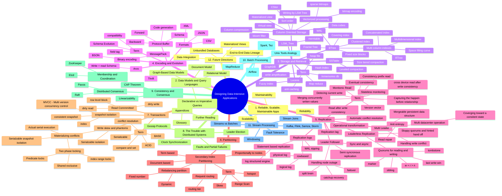

```mermaid
mindmap
  root((Designing Data-Intensive Applications))
  
    1. Reliable, Scalable, Maintainable Apps
      Reliability
      Scalability
      Maintainability

    2. Data Models and Query Languages
      Relational Model
      Document Model
      Graph-Based Data Models
      Declarative vs Imperative Queries

    3. Storage and Retrieval
      Hash Index
      SSTable
        Leveled compaction
        Size tiered compaction
      LSM_Tree
        memtable
        bloom filter
      BTree
        WAL
        Fixed size blocks
        Fractal Tree
        Clustered index
        Covering index
        Multi column indexes
          Concatenated index
          Multidimensional index
          Space filling curve
          RTree
      Lucene
        Fuzzy index
      GraphDB
      Column Oriented Storage
        Sort order
          CStor
        Writing by LSM Tree
        Column compression
        Vectorized processing
          bitmap encoding
          sparse bitmaps
        Data cubes
        Materialized view
        Virtual view
      Term
        write amplification
        heap file
        anti caching
        Map reduce
        Inmemories db

    4. Encoding and Evolution
      Formats
        XML
        JSON
        CSV
      Binary encoding
        MessagePack
        BSON
      Thrift
      Protocol Buffer
        Schema
        Code generation
        Forward
        Backward
      Arvo
        Write + read Schema
      Term
        Schema Evolution
        field tag
        compatibility

    5. Replication
      Leader Follower
        Handling node outage
          split brain
          failover
          catchup recovery
        Sync and async
        Semi syncronous replication
      Replication logs
        WAL sipping
        rowbased
          logical log
          physical log
        Statement based replication 
          log structured engine
      Replication lag
      Multi Leader
        Multi datacenter operation
          Coverging toward a consitent state
        Handling write conflict
        Mergeable persistent data structure
      Leaderless Replication
        Anti entropy
          Read repair
        Quorums for reading and writing
          w + r > n
          last write win
          sibling
          tombstone
          marker
        Sloppy quorums and hinted hand off
      Automatic conflict resolution
        Operational transformation
      Term
        Monitonic Read
        Consistency prefix read
        Eventual consistency
        Read after write consistency
        cross device read after write consistency
        Stateless monitoring
        Detecing current write
        Merging concurrently writen values
        Version vector
        Capturing the happen before relationship

    6. Partitioning
      Secondary Index Partitioning
        Term based
        Document based
        Proportionally to nodes
        Rebalancing partition
          Fixed number
          Dynamic
        Request routing
          routing tier
        Term
          Range Scan
          Skew
          hotspot

    7. Transactions
      Read Commmitted
        row level block
        dirty read
        dirty write
      snapshot isolation
        index
        MVCC - Multi version concurrency control
        consistent snapshot
      Write skew and phantoms
        Materializing conflicts
          Actual serial execution
          Two phase locking
            Shared exclusive
            Predicate locks
            index range locks
          Serialzable snapshot isolation
        Serialzable isolation
      Term
        ACID
        BASE
        Serializable
        compare and set
        conflict resolution

    8. The Trouble with Distributed Systems
      Faults and Partial Failures
      Clock Synchronization
      Leader Election
      Gossip Protocols

    9. Consistency and Consensus
      Linearizability
      CAP Theorem
      Distributed Consensus
        Paxos
        Raft
      Membership and Coordination
        ZooKeeper
        Etcd

    10. Batch Processing
      Unix Tools Analogy
      MapReduce
      Dataflow Engines (Spark, Tez)
      Workflow Schedulers (Airflow)

    11. Stream Processing
      Streams vs Batches
      Stream Joins
      Windowing
      Fault Tolerance
      Kafka, Flink, Samza, Storm

    12. Future Directions
      Data Integration
      Unbundled Databases
      Materialized Views
      End-to-End Data Lineage

    Appendices
      Further Reading
      Glossary

```