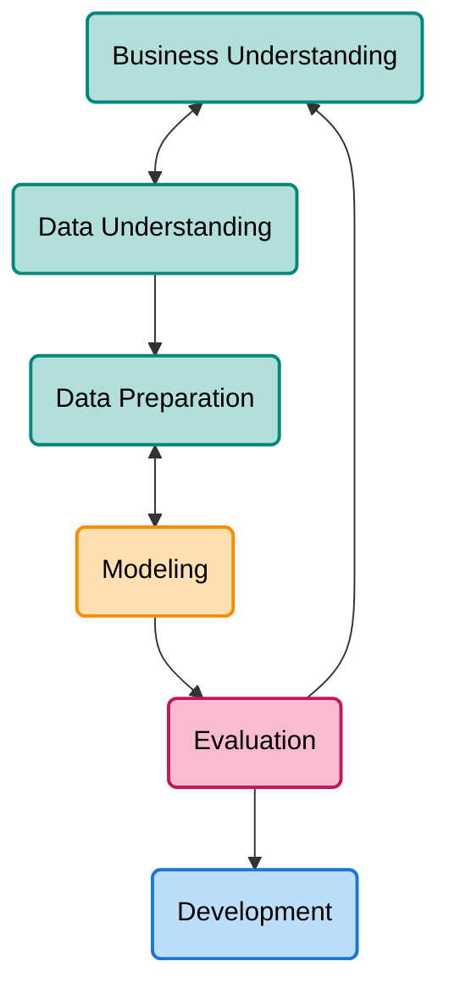

# Business Problems and Data Science Solutions

`Data mining is a craft. As with many crafts, there is a well-defined process that can help
to increase the likelihood of a successful result`

## Data mining process

### Business understanding

- What exactly do we want to do? 
- How exactly would we do it? 
- What parts of this use scenario constitute possible data mining models?

### Data understanding

- Understand the strengths and limitations of the data

### Data preparation

- The data are manipulated and converted into forms that yield better results.

### Modeling

- Data mining techniques are applied

### Evaluation

- Have confidence that the models and patterns extracted from the data are true regularities and not just idiosyncrasies or sample anomalies
- Possible to deploy results immediately after data mining 
- To help ensure that the model satisfies the original business goals

### Deployment

- The model be recoded for the production environment

## Implications for Managing the Data Science Team

- Mistake: view the data mining process as a software development cycle
    - It iterates on approaches and strategy rather than on software designs
    - Analytics skill for a team:
        - formulate problems well
        - **prototype** solutions **quickly**
        - **make reasonable assumptions** in the face of **ill-structured problems**
        - design **experiments** that represent **good investments**
        - **analyze results**

## Analytics techniques

- Statistics
- Database quering
- Data warehouses
    - Collect and coalesce data from across an enterprise
- Regression Analysis
    - A way of mathematically sorting out which of those variables does indeed have an impact
- Machine Learning (methods)
- Data Mining (or KDD: Knowledge Discovery and Data Mining)
