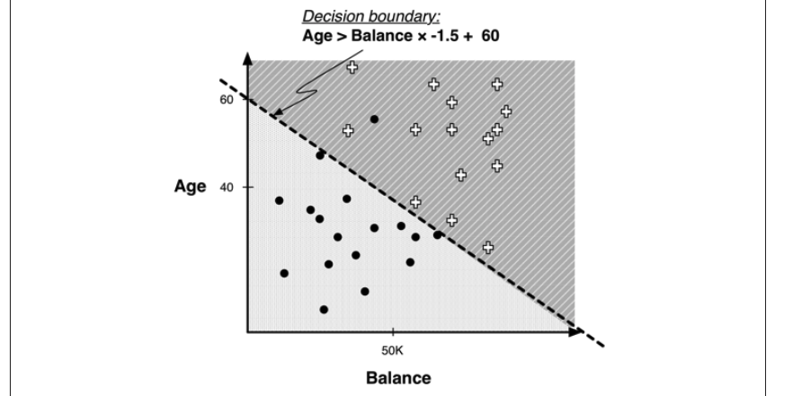
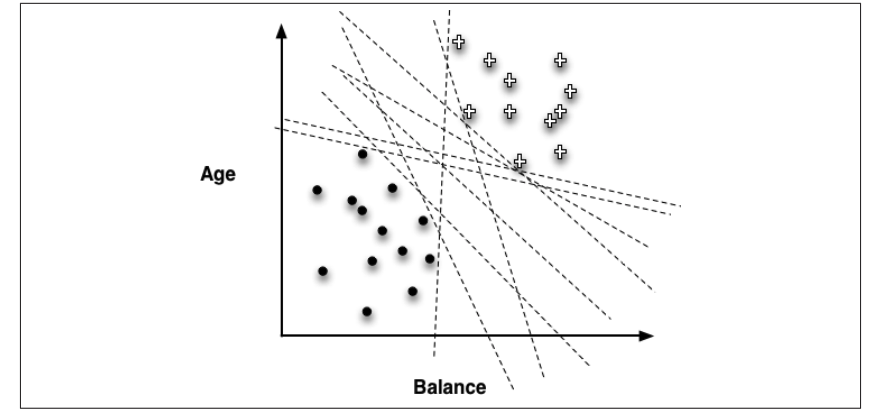
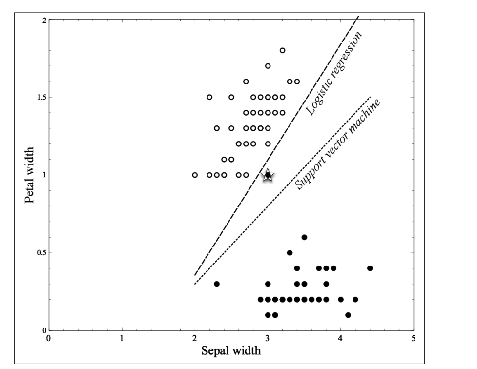
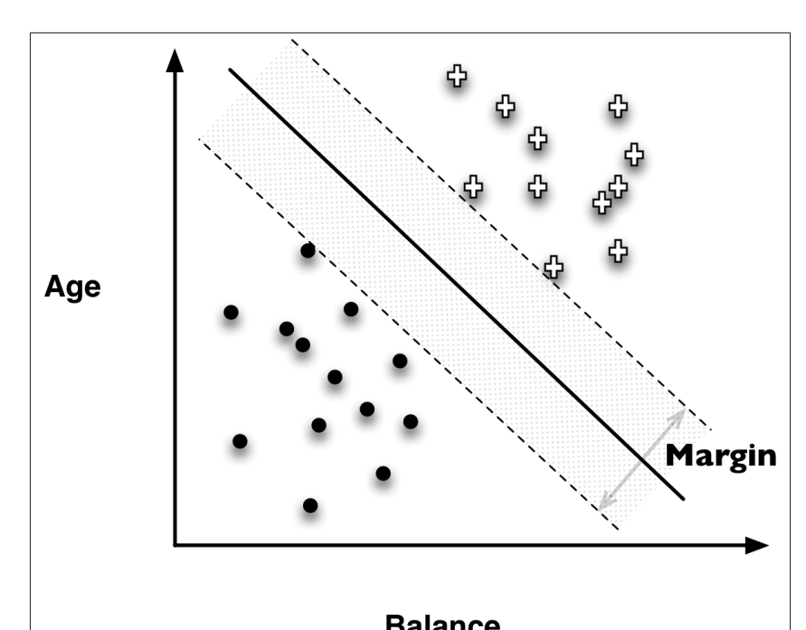

# Phân vùng không gian mẫu (Instance Space) và Phân biệt tuyến tính (Linear Classifier)

- chúng ta đã học về cách mô hình cây quyết định (decision tree) phân chia không gian mẫu (instance space) thành các vùng nhỏ hơn, nơi các điểm dữ liệu trong cùng một vùng có xu hướng có giá trị target giống nhau. Việc chia nhỏ này giúp ta dễ dàng dự đoán giá trị target của một mẫu mới dựa trên vùng mà nó thuộc vào.
- Tuy nhiên, việc chia không gian bằng những đường song song với trục (như trong cây quyết định) không phải lúc nào cũng tối ưu.
- Phân biệt tuyến tính (Linear Classifier): Thay vì chỉ chia bằng các đường song song trục, ta có thể sử dụng một đường thẳng (hoặc mặt phẳng trong không gian cao hơn) để phân chia các lớp
    - Ví dụ: Ta có thể vẽ một đường thẳng xiên qua dữ liệu để tách hai nhóm điểm tốt hơn.
    -   
- `f(x) = w0 + w1x1 + w2x2 + ... + wnxn`
    - w1, w2, ..., wn: trọng số (weights) ứng với các thuộc tính x1, x2, ..., xn.
    - Điểm quan trọng ở đây là:
        - Data Mining sẽ tìm ra bộ trọng số (w0, w1, w2, ...) tối ưu nhất để mô hình phân biệt tốt nhất giữa các lớp trên dữ liệu huấn luyện.
        - Trọng số (wi) càng lớn (hoặc nhỏ, xét theo trị tuyệt đối) → Thuộc tính xi càng quan trọng trong việc phân loại.
        - Nếu trọng số gần 0 → Thuộc tính đó có thể ít quan trọng hoặc thậm chí loại bỏ được.
    -   
- Vấn đề lớn cần giải quyết: Tìm trọng số tốt nhất (Model Fitting)
    - Ta gọi đây là parameterized model — tức mô hình có tham số (weights) cần phải "học" từ dữ liệu.
- Objective Function (Hàm mục tiêu)
    - Đây là hàm số giúp ta đánh giá độ tốt của mô hình khi gán một bộ trọng số cụ thể.
- Sự khác biệt giữa các mô hình học máy không phải nằm ở việc chúng có học hay không.
    - Mà là ở chỗ: "Mục tiêu tối ưu (Objective Function) của chúng khác nhau."
    - Đường nào là tốt hơn? Tuỳ mục tiêu là gì
        - Nếu cần phân loại chính xác tuyệt đối trong tập huấn luyện → Logistic Regression có vẻ tốt.
        - Nếu cần mô hình tổng quát hoá tốt, chịu được dữ liệu nhiễu/outlier → SVM có thể tốt hơn
    -   

# Linear Discriminant Functions (Hàm phân biệt tuyến tính) — Dùng để Tính Điểm và Xếp Hạng Mức Độ Khả Năng Thuộc Về Nhóm (Class)

- Trong nhiều trường hợp thực tế, chúng ta không chỉ muốn trả lời "Có" hay "Không" (Yes/No) một cách đơn giản xem một khách hàng có thuộc nhóm mục tiêu hay không — mà ta muốn biết:
- Có 2 cách tiếp cận:
    - Dự đoán Xác Suất (Probability Estimate)
        - Ví dụ Logistic Regression → Tính xác suất % thuộc nhóm
    - Tính Điểm Để Xếp Hạng (Scoring/Ranking)
        - Chỉ cần một con số để so sánh, xếp hạng người dùng theo khả năng
- Ta có một hàm số đơn giản: `f(x) = w₁x₁ + w₂x₂ + ... + wₙxₙ + b`

# Support Vector Machines (SVM)

- SVM về bản chất cũng chỉ là một mô hình phân loại tuyến tính (linear model) giống như các mô hình mình đã học trước đó — nó dùng một đường thẳng (trong không gian 2D), hoặc mặt phẳng (trong không gian nhiều chiều) để phân chia dữ liệu thành các lớp khác nhau.
- dựa trên 2 ý tưởng chính:
    - Tối đa hóa khoảng cách giữa 2 lớp (Maximize Margin)
        - Khi có nhiều đường thẳng khác nhau có thể phân chia được dữ liệu, câu hỏi đặt ra là: chọn đường nào tốt nhất?
        - SVM chọn ra đường phân cách sao cho khoảng cách giữa đường đó và các điểm dữ liệu gần nhất của mỗi lớp là lớn nhất. Người ta gọi khoảng cách này là margin.
        - Khoảng cách càng lớn → mô hình càng "an toàn" khi gặp dữ liệu mới, vì khả năng mẫu mới bị rơi nhầm sang lớp khác sẽ thấp hơn.
    - Xử lý dữ liệu không thể phân chia hoàn toàn tuyến tính (Soft Margin)
        - Trong thực tế, dữ liệu thường không đẹp như trong sách giáo khoa — sẽ có những điểm nằm sai vị trí, không thể phân tách hoàn hảo bằng 1 đường thẳng.
            - Cho phép một số điểm bị "lệch" sang vùng của lớp còn lại.
            - Nhưng sẽ phạt các điểm đó trong hàm tối ưu.
            - Điểm nào càng nằm sâu trong vùng sai thì bị phạt nặng hơn.
    -   
- Hinge Loss: Đây là hàm phạt (loss function) SVM dùng. Nó không chỉ quan tâm đúng hay sai, mà còn quan tâm "sai ít" hay "sai nhiều".
- SVM phi tuyến (Nonlinear SVM): SVM ban đầu chỉ phân chia tuyến tính. Nhưng nếu dữ liệu quá phức tạp thì sao?
    - SVM sẽ dùng kỹ thuật biến đổi đặc trưng (Feature Transformation) để biến dữ liệu sang không gian khác, nơi mà việc phân chia trở nên dễ dàng hơn.
    - Công cụ hay dùng là Kernel Trick — cho phép tính toán nhanh mà không cần thực sự biến đổi dữ liệu.

# Hồi quy (Regression) 

- Hồi quy là gì? Dự đoán giá trị số dựa trên mô hình toán học (thường là tuyến tính)

## Hàm mất mát (Loss function)

- Hàm mất mát sẽ xác định xem sai bao nhiêu thì bị phạt bao nhiêu.

| Kiểu hàm mất mát       | Ý nghĩa                                                          | Ứng dụng chính                             |  
|------------------------|------------------------------------------------------------------|--------------------------------------------|  
| Hinge Loss             | Phạt khi dữ liệu bị phân loại sai hoặc nằm sai bên lề (margin) | Dùng trong SVM (Support Vector Machine)   |  
| Zero-One Loss          | Đúng thì phạt 0, sai thì phạt 1                                 | Đơn giản, dùng để đánh giá mô hình        |  
| Squared Error Loss     | Phạt dựa trên bình phương khoảng cách giữa giá trị dự đoán và giá trị thực tế | Dùng trong hồi quy (Regression)           |  

## Hồi quy tuyến tính (Linear Regression)

- `f(x) = w0 + w1 * x1 + w2 * x2 + … + wn * xn`
- Vậy làm sao để biết mô hình học tốt hay chưa? Cần có một "mục tiêu tối ưu" (Objective Function) để đo lường sai số và tìm cách giảm sai số này.
- Có nhiều cách chọn hàm mục tiêu, nhưng phổ biến nhất trong hồi quy tuyến tính là:
    - Minimize Sum of Squared Errors (Giảm tổng bình phương sai số): Tìm tập hệ số (w) sao cho mô hình dự đoán gần đúng nhất với giá trị thực tế trên tập dữ liệu huấn luyện.
    - Squared Error phạt rất mạnh với các sai số lớn → phù hợp khi ta muốn tránh sai sót nghiêm trọng.
    - Hạn chế của Squared Error
        - Squared Error có nhược điểm là rất nhạy cảm với dữ liệu ngoại lai (outlier) hoặc lỗi nhập liệu. Một vài điểm dữ liệu sai lệch có thể làm lệch cả mô hình.
            - Nếu làm bài toán hồi quy mà dữ liệu có nhiều nhiễu → có thể cân nhắc dùng Absolute Error (giảm độ nhạy với outlier)
            -Hoặc dùng các phương pháp hồi quy "robust" hơn.
