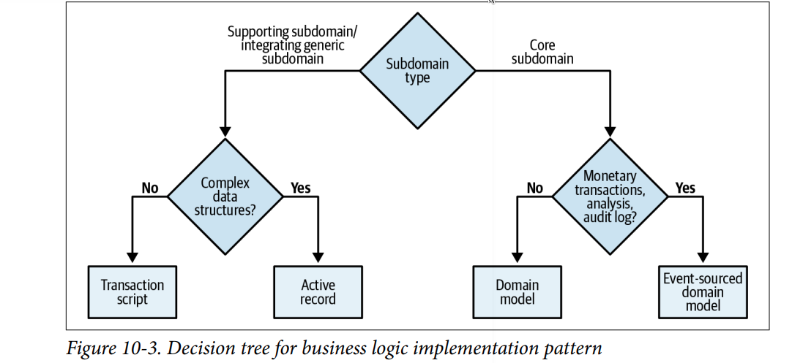
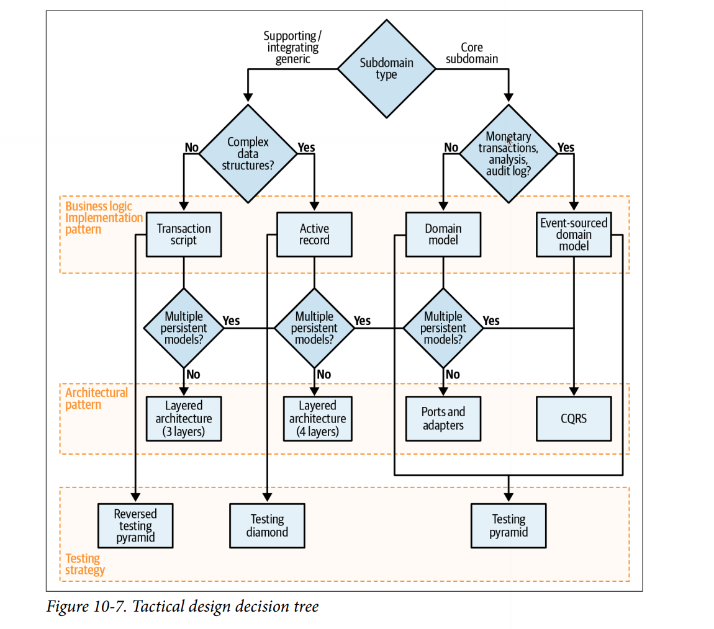

# Model Translation 

## Stateless Model Translation

- triển khai mẫu thiết kế proxy (proxy design pattern) để chèn vào luồng xử lý các yêu cầu đến hoặc đi, và chuyển đổi mô hình nguồn sang mô hình đích phù hợp với ngữ cảnh giới hạn của nó
- Triển khai proxy sẽ phụ thuộc vào việc giao tiếp giữa các ngữ cảnh là đồng bộ hay bất đồng bộ.

### Synchronous

- nhúng trực tiếp logic chuyển đổi vào mã nguồn của ngữ cảnh giới hạn
- việc chuyển đổi mô hình có thể hiệu quả hơn nếu được tách riêng ra một thành phần bên ngoài, ví dụ như thông qua mẫu thiết kế API Gateway.tổng hợp các yêu cầu đến và xử lý theo lô (batch) nhằm tối ưu hiệu năng. Trong trường hợp này, việc tổng hợp có thể cần thiết cho cả yêu cầu đồng bộ và bất đồng bộ,

### Asynchronous

- triển khai một message proxy: một thành phần trung gian đăng ký nhận các thông điệp từ ngữ cảnh nguồn, thực hiện chuyển đổi mô hình, và chuyển tiếp thông điệp đã chuyển đổi đến bên tiêu thụ

## Stateful Model Translation

### Aggregating incoming data

- tổng hợp các yêu cầu đến và xử lý theo lô (batch) nhằm tối ưu hiệu năng. Trong trường hợp này, việc tổng hợp có thể cần thiết cho cả yêu cầu đồng bộ và bất đồng bộ
- kết hợp nhiều thông điệp nhỏ (fine-grained messages) thành một thông điệp duy nhất chứa toàn bộ dữ liệu đã hợp nhất

### Outbox Pattern

- Outbox đảm bảo việc gửi domain event là đáng tin cậy
    - Không gửi event trực tiếp khi xử lý logic.
    - Thay vào đó, lưu các event vào một "outbox" (bảng hoặc phần trong tài liệu DB).
    - Sau đó, một background worker (message relay) sẽ:
        - Lấy các event chưa gửi từ DB.
        - Gửi lên message bus.
        - Đánh dấu là đã gửi (hoặc xóa).

### Saga

- Mỗi transaction chỉ nên giới hạn trong phạm vi một aggregate duy nhất.
- Strong Consistency
    - Là loại nhất quán đảm bảo 100% dữ liệu luôn đúng ngay lập tức sau mỗi thay đổi.
    - Áp dụng được khi mọi dữ liệu cần cập nhật đều nằm trong cùng một aggregate
- Eventual Consistency
    - Xảy ra khi dữ liệu liên quan đến nhiều aggregate khác nhau.
    - Không thể đảm bảo mọi phần của hệ thống cập nhật đồng bộ ngay lập tức.
    - Thay vào đó, dữ liệu sẽ "cập nhật dần", thông qua các event và command.
    - Đây là nơi Saga phát huy hiệu quả: lắng nghe, phản ứng và đảm bảo rằng toàn bộ quy trình cuối cùng sẽ đạt đến trạng thái hợp lệ.
- `Chỉ dữ liệu nằm trong cùng một aggregate mới được đảm bảo nhất quán tuyệt đối (strong consistency).`
- `Mọi thứ nằm ngoài aggregate chỉ nên được đồng bộ dần thông qua event`

### Process Manager

- Saga thường điều phối các bước tuần tự đơn giản, dạng “sự kiện → lệnh” (event-to-command).
- PM Là một đơn vị xử lý trung tâm (central processing unit) có trạng thái riêng và có thể xác định các bước tiếp theo dựa trên logic nghiệp vụ.
    - Được dùng để điều phối các quy trình phức tạp, có điều kiện, không đơn giản chỉ là “nối sự kiện với lệnh”.
    - Nếu bạn thấy trong Saga có các câu điều kiện if-else → khả năng cao bạn đang cần một Process Manager.

## Heuristic

- Heuristic là một phương pháp giải quyết vấn đề hiệu quả, bằng cách bỏ qua các tín hiệu nhiễu, và tập trung vào các yếu tố chính yếu có ảnh hưởng lớn nhất.
- `Có rất nhiều heuristic hữu ích để xác định ranh giới dịch vụ. Kích thước là một trong những yếu tố kém hữu ích nhất.`
- Việc refactor lại các bounded context tốn kém và phức tạp, đặc biệt khi mỗi context do team khác nhau quản lý.
    - ➡ Và kết quả thường là: những ranh giới không tối ưu này không được xử lý và trở thành technical debt.
- Khi domain chưa rõ ràng, hoặc yêu cầu thay đổi liên tục, hãy bắt đầu với ngữ cảnh rộng (large bounded context)
    - Gộp các subdomain có liên kết mật thiết vào cùng một bounded context 
    - → Điều này áp dụng chủ yếu cho core subdomains, vốn luôn thay đổi ở giai đoạn đầu.
    - ➡ Khi đã hiểu rõ hơn về domain, bạn có thể chia nhỏ sau mà không phải chịu chi phí cao từ đầu.
- Refactor ranh giới logic (code) luôn rẻ hơn refactor ranh giới vật lý (dịch vụ, database, đội nhóm).

## Decision tree

-   
-   
