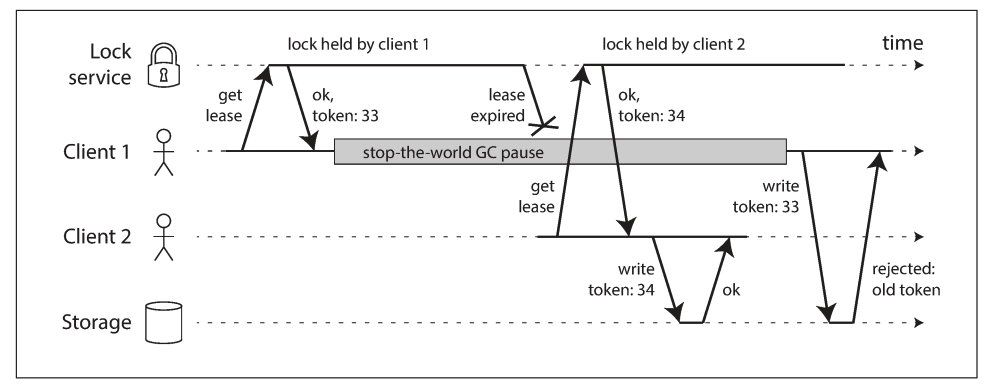
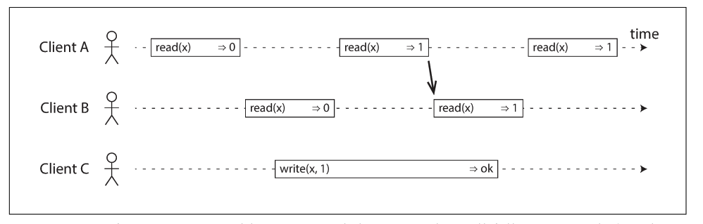
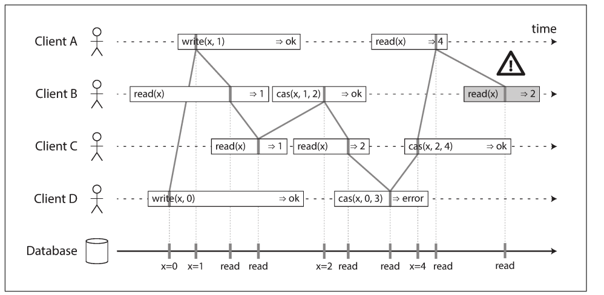

# The Trouble with Distributed Systems

- cần biết phần mềm phản ứng như thế nào trước sự cố mạng và đảm bảo hệ thống có thể phục hồi
- Một số ứng dụng nhạy cảm với độ trễ, chẳng hạn như hội nghị truyền hình và Voice over IP (VoIP), sử dụng giao thức UDP thay vì TCP. Đây là một sự đánh đổi giữa độ tin cậy và độ biến thiên của độ trễ: do UDP không thực hiện điều khiển luồng và không truyền lại các gói tin bị mất, nên nó tránh được một số nguyên nhân gây ra độ trễ mạng thay đổi

## Synchronous Versus Asynchronous Networks

- Các hệ thống phân tán sẽ đơn giản hơn rất nhiều nếu chúng ta có thể dựa vào mạng để truyền gói tin với một độ trễ tối đa cố định và không mất gói. Tại sao không giải quyết vấn đề này ở tầng phần cứng để phần mềm không cần phải lo lắng?
- Chuyen mach mach nhu di dong se gioi han goi tin (16bit) nen khong co do tre do hang doi, nhung chuyen mach goi(TCP) giup linh hoach va tan dung bandwidth tot hon

## Clocks

- Trong hệ thống phân tán, thời gian là một vấn đề phức tạp
- mỗi máy trong mạng có đồng hồ riêng của mình, là một thiết bị phần cứng thực sự – thường là bộ dao động tinh thể thạch anh
- Những thiết bị này không hoàn toàn chính xác, do đó mỗi máy có một khái niệm thời gian hơi nhanh hoặc chậm hơn các máy khác
- có thể đồng bộ hóa các đồng hồ ở một mức độ nhất định: cơ chế được sử dụng phổ biến nhất là Giao thức Thời gian Mạng (NTP), 
    - ác máy chủ này lấy thời gian từ các nguồn chính xác hơn, chẳng hạn như thiết bị GPS.
- Máy tính hiện đại thường có ít nhất hai loại đồng hồ: đồng hồ theo giờ (time-of-day clock) và đồng hồ monotonic.

### Đồng hồ theo giờ (time-of-day clock)

- trả về ngày và giờ hiện tại theo lịch
- thường được đồng bộ bằng NTP, nghĩa là một timestamp từ một máy (lý tưởng) có cùng ý nghĩa với timestamp từ máy khác. 
- loại đồng hồ này có nhiều điểm kỳ lạ, ví dụ:
    - Nếu đồng hồ máy vượt xa máy chủ NTP, nó có thể bị thiết lập lại đột ngột, dẫn đến nhảy ngược về thời gian trước đó.
    - Đồng hồ này cũng bỏ qua giây nhuận, khiến nó không phù hợp để đo khoảng thời gian.

### Đồng hồ monotonic

- phù hợp để đo khoảng thời gian, chẳng hạn như timeout hoặc thời gian phản hồi của dịch vụ
- Đặc điểm nổi bật của nó là: nó luôn tiến về phía trước (không bao giờ nhảy ngược như đồng hồ theo giờ).
- Tuy nhiên, giá trị tuyệt đối của đồng hồ này không có ý nghĩa cụ thể
    - Không nên so sánh đồng hồ monotonic giữa hai máy, vì chúng không đồng bộ và không có cùng gốc thời gian.
- NTP có thể điều chỉnh tốc độ đồng hồ monotonic (gọi là slewing), để bù trừ khi máy chạy nhanh hoặc chậm, nhưng nó không làm nhảy đồng hồ về phía trước hoặc sau

### Clock Synchronization and Accuracy

- Đồng hồ monotonic không cần đồng bộ hóa.
- Đồng hồ theo giờ phải được đồng bộ với NTP hoặc nguồn ngoài để có ích.
- Tuy nhiên, việc đồng bộ không đáng tin cậy như bạn tưởng – cả phần cứng và NTP đều có thể trục trặc:
    - Đồng hồ thạch anh không chính xác: tốc độ lệch theo nhiệt độ. Google giả định sai số 200 ppm (~6 ms mỗi 30 giây, hoặc ~17 giây mỗi ngày).
    - Nếu đồng hồ lệch quá xa so với máy chủ NTP, nó có thể từ chối đồng bộ hoặc nhảy cóc thời gian, gây lỗi cho ứng dụng.
    - Một máy có thể bị cấu hình sai (hoặc bị firewall chặn NTP) mà không ai biết.
    - NTP chỉ chính xác nếu mạng tốt. Khi mạng chậm, có thể sai lệch 35 ms hoặc thậm chí lên đến 1 giây.
    - Một số máy chủ NTP báo sai giờ (sai hàng giờ), nhưng NTP client có thể chống chịu bằng cách bỏ qua những máy lệch quá xa.
    - Giây nhuận (leap seconds) có thể tạo ra một phút dài 59 hoặc 61 giây – nhiều hệ thống đã sập vì giây nhuận. Một số NTP server "nói dối" để tránh vấn đề (gọi là smearing, phân tán giây nhuận trong một ngày).
    - Trong máy ảo, đồng hồ là ảo hóa – khi CPU bị chia sẻ, một VM có thể "đứng yên" rồi nhảy vọt thời gian khi trở lại.
    - Trên các thiết bị không thể kiểm soát hoàn toàn (như điện thoại, thiết bị nhúng), người dùng có thể cố tình đặt sai giờ để gian lận.

### Clock readings have a confidence interval

- không hợp lý khi xem giá trị đồng hồ như một điểm thời gian cụ thể — nó giống như một khoảng thời gian hơn, nằm trong một khoảng tin cậy

## Process Pauses

- Hãy xét một ví dụ khác về việc sử dụng đồng hồ một cách nguy hiểm trong hệ thống phân tán. Giả sử bạn có một cơ sở dữ liệu với mỗi phân vùng chỉ có một leader duy nhất. Chỉ leader mới được phép chấp nhận các thao tác ghi. Vậy một nút biết rằng nó vẫn là leader (và chưa bị các nút khác tuyên bố là đã chết) bằng cách nào, và làm sao để biết chắc chắn rằng nó vẫn có thể xử lý ghi một cách an toàn?
- Một cách để làm điều đó là leader nhận được một lease (phiếu thuê/quyền sở hữu tạm thời) từ các nút khác, hoạt động giống như một khóa có thời gian hết hạn [63]. Chỉ một nút có thể giữ lease tại một thời điểm — vì vậy khi một nút nhận được lease, nó biết rằng mình là leader trong một khoảng thời gian nhất định, cho đến khi lease hết hạn. Để tiếp tục làm leader, nút đó cần phải gia hạn lease định kỳ trước khi nó hết hạn. Nếu nút đó gặp lỗi, nó sẽ ngừng gia hạn lease, cho phép một nút khác tiếp quản khi lease hết hạn.

## Limiting the impact of garbage collection

- Trong hệ thống nhúng, "thời gian thực" nghĩa là hệ thống được thiết kế và kiểm tra cẩn thận để đáp ứng các yêu cầu thời gian trong mọi hoàn cảnh. Điều này khác với cách sử dụng mơ hồ hơn của cụm từ "real-time" trên web, nơi nó thường dùng để chỉ việc máy chủ đẩy dữ liệu đến client hoặc xử lý dòng dữ liệu (streaming) mà không có ràng buộc thời gian phản hồi nghiêm ngặt 
- Một ý tưởng mới đang nổi lên là xem các lần dọn rác như những lần ngừng hoạt động ngắn có kế hoạch của một node, và để các node khác xử lý các yêu cầu từ client trong khi một node đang thu gom rác. Nếu runtime có thể cảnh báo trước cho ứng dụng rằng node sắp cần dọn rác, ứng dụng có thể ngừng gửi yêu cầu mới đến node đó, chờ nó xử lý xong các yêu cầu hiện tại, rồi thực hiện GC trong lúc không có yêu cầu nào đang được xử lý.

## Truth, and Lies

- Hệ quả của những vấn đề này có thể khiến bạn bối rối nếu chưa quen với hệ thống phân tán. Một node trong mạng không thể biết điều gì là chắc chắn — nó chỉ có thể phỏng đoán dựa trên các thông điệp mà nó nhận được (hoặc không nhận được) qua mạng. Một node chỉ có thể biết trạng thái của node khác (nó đang lưu dữ liệu gì, có đang hoạt động bình thường không, v.v.) bằng cách trao đổi thông điệp. Nếu một node từ xa không phản hồi, không có cách nào chắc chắn để biết chuyện gì đang xảy ra với nó, vì bạn không thể phân biệt rõ ràng giữa lỗi mạng và lỗi node.

### Story

- Hãy tưởng tượng một mạng lưới với lỗi không đối xứng: một nút có thể nhận tất cả các thông điệp gửi đến nó, nhưng mọi thông điệp đi ra từ nút đó đều bị rơi hoặc trì hoãn. Mặc dù nút đó hoạt động hoàn hảo và nhận được yêu cầu từ các nút khác, nhưng các nút kia không thể nghe thấy phản hồi của nó. Sau một thời gian chờ, các nút khác sẽ tuyên bố nó là chết, bởi vì chúng không nhận được phản hồi từ nút đó. Tình huống diễn ra như một cơn ác mộng: nút nửa mất kết nối bị kéo vào nghĩa địa, vừa la hét “Tôi không chết!”—nhưng vì không ai nghe thấy tiếng la hét của nó, đoàn rước linh cữu vẫn tiếp tục một cách kiên định.
- Trong một kịch bản ít đáng sợ hơn, nút nửa mất kết nối có thể nhận ra rằng các thông điệp nó gửi không được các nút khác xác nhận, và vì vậy nó nhận ra rằng có một sự cố trong mạng. Tuy nhiên, nút đó vẫn bị các nút khác tuyên bố là chết và không thể làm gì để thay đổi điều đó.
- Trong kịch bản thứ ba, tưởng tượng một nút gặp phải một khoảng dừng do thu gom rác "stop-the-world" kéo dài. Tất cả các luồng của nút đều bị GC tạm ngừng và chờ trong một phút, và do đó, không có yêu cầu nào được xử lý và không có phản hồi nào được gửi. Các nút khác chờ đợi, thử lại, ngày càng mất kiên nhẫn, và cuối cùng tuyên bố nút đó đã chết và đưa nó vào xe tang. Cuối cùng, GC hoàn thành và các luồng của nút tiếp tục như thể không có chuyện gì xảy ra. Các nút khác ngạc nhiên khi nút được cho là đã chết đột nhiên ngóc đầu lên từ quan tài, khỏe mạnh và vui vẻ bắt đầu trò chuyện với những người đứng xung quanh. Lúc đầu, nút đang thu gom rác không nhận ra rằng một phút đã trôi qua và nó đã bị tuyên bố là chết—từ góc nhìn của nó, chẳng có gì thay đổi kể từ lần cuối nó trò chuyện với các nút khác.
- Bài học từ những câu chuyện này là một nút không thể tin tưởng hoàn toàn vào phán đoán của chính nó về một tình huống. Một hệ thống phân tán không thể chỉ dựa vào một nút duy nhất, vì một nút có thể gặp sự cố bất cứ lúc nào, có thể khiến hệ thống bị kẹt và không thể phục hồi. Thay vào đó, nhiều thuật toán phân tán dựa vào một đa số, tức là bỏ phiếu giữa các nút  
    - các quyết định yêu cầu một số phiếu tối thiểu từ nhiều nút để giảm bớt sự phụ thuộc vào bất kỳ nút cụ thể nào.

- Thường xuyên, một hệ thống yêu cầu chỉ có một đối tượng duy nhất, vd:
    - Chỉ một nút được phép làm lãnh đạo
    - Chỉ một giao dịch hoặc khách hàng được phép giữ khóa cho một tài nguyên
    - Chỉ một người dùng được phép đăng ký một tên người dùng cụ thể
- Việc triển khai điều này trong một hệ thống phân tán đòi hỏi phải cẩn thận: ngay cả khi một nút tin rằng nó là "người được chọn", điều đó không nhất thiết có nghĩa là một đa số các nút đồng ý
    - Nếu một nút tiếp tục hành động như thể nó là người được chọn, mặc dù đa số các nút đã tuyên bố nó là chết, điều này có thể gây ra sự cố trong một hệ thống không được thiết kế cẩn thận.

#### Fencing tokens

### Byzantine Faults

- Các vấn đề trong hệ thống phân tán trở nên khó khăn hơn nhiều nếu có nguy cơ các nút có thể "nói dối" (gửi các phản hồi sai hoặc bị lỗi)
    - ví dụ, nếu một nút có thể tuyên bố đã nhận một tin nhắn cụ thể khi thực tế nó không nhận được. Hành vi như vậy được gọi là lỗi Byzantine, và vấn đề đạt được sự đồng thuận trong môi trường không tin tưởng này được gọi là Vấn đề các Tướng quân Byzantine

# Consistency and Consensus

`Cách tốt nhất để xây dựng hệ thống chịu lỗi là tìm ra một số trừu tượng tổng quát với những đảm bảo hữu ích, triển khai chúng một lần, và sau đó để các ứng dụng dựa vào những đảm bảo đó. Đây cũng chính là cách mà chúng ta đã dùng với Transaction`

## Linearizability

- Trong một cơ sở dữ liệu có tính nhất quán theo thời gian (eventual consistency), nếu bạn hỏi hai bản sao khác nhau cùng một câu hỏi tại cùng một thời điểm, bạn có thể nhận được hai câu trả lời khác nhau. Điều đó thật khó hiểu. 
- Sẽ đơn giản hơn nhiều nếu cơ sở dữ liệu có thể tạo ảo giác rằng chỉ tồn tại một bản sao duy nhất (tức là chỉ có một bản dữ liệu). Khi đó, mọi khách hàng (client) đều có cùng một cái nhìn về dữ liệu, và bạn sẽ không phải lo lắng về độ trễ của việc sao chép (replication lag).
- Đây chính là ý tưởng đằng sau tính tuyến tính (**linearizability**)
- Trong một hệ thống tuyến tính, ngay khi một client hoàn thành thao tác ghi (write), tất cả các client đọc từ cơ sở dữ liệu đều phải thấy giá trị vừa được ghi. Duy trì ảo giác về một bản sao duy nhất của dữ liệu có nghĩa là đảm bảo rằng giá trị đọc là giá trị mới nhất, cập nhật nhất, chứ không đến từ bộ nhớ cache hoặc bản sao lỗi thời
 
### Điều gì khiến một hệ thống có tính tuyến tính?

- Ý tưởng cơ bản của tuyến tính khá đơn giản: làm cho hệ thống trông như chỉ có một bản sao duy nhất của dữ liệu.
- 
- Trong một hệ thống linearizable, ta tưởng tượng rằng phải có một thời điểm cụ thể nào đó (nằm giữa lúc bắt đầu và kết thúc của thao tác ghi) mà tại đó giá trị của x thay đổi một cách nguyên tử từ 0 sang 1. Do đó, nếu một client đọc được giá trị mới là 1, thì tất cả các lần đọc sau đó cũng phải trả về giá trị mới đó, ngay cả khi thao tác ghi vẫn chưa hoàn tất.
- 
- phân biệt rõ ràng:
    - Serializability (Tuần tự hóa):
        - Là một tính chất cách ly (isolation) của các giao dịch, nơi mỗi giao dịch có thể đọc và ghi nhiều đối tượng (dòng, tài liệu, bản ghi...). Nó đảm bảo rằng các giao dịch sẽ hoạt động như thể chúng được thực thi theo một thứ tự tuần tự (mỗi giao dịch hoàn tất trước khi giao dịch tiếp theo bắt đầu). Việc thứ tự đó có trùng với thứ tự thực tế hay không không quan trọng.
    - Linearizability (Tuyến tính hóa):
        - Là một cam kết về tính cập nhật gần nhất đối với các thao tác đọc và ghi trên một thanh ghi (tức là một đối tượng riêng lẻ). Nó không nhóm các thao tác lại thành giao dịch, nên không thể ngăn ngừa các vấn đề như write skew, trừ khi bạn có thêm biện pháp như materializing conflicts

### Vậy trong những trường hợp nào thì tính tuyến tính là hữu ích?

- một kết quả chậm vài giây hầu như không gây hại gì.
- Tuy nhiên, có một số lĩnh vực mà tính tuyến tính là điều kiện quan trọng để hệ thống hoạt động đúng cách.
    - Locking and Leader election
        - Một cách để bầu chọn leader là sử dụng một cơ chế khóa (lock): mọi nút khi khởi động sẽ cố gắng chiếm khóa, và nút nào thành công sẽ trở thành leader
        - Dù cơ chế khóa được triển khai thế nào đi nữa, nó phải đảm bảo tính tuyến tính: tất cả các nút phải đồng thuận về nút nào đang giữ khóa; nếu không thì khóa đó trở nên vô dụng.
        - Cơ chế khóa phân tán cũng được sử dụng ở mức độ chi tiết hơn nhiều trong một số hệ quản trị cơ sở dữ liệu phân tán như Oracle Real Application Clusters (RAC). 
            - RAC sử dụng một khóa cho mỗi trang đĩa, với nhiều nút cùng chia sẻ quyền truy cập vào cùng một hệ thống lưu trữ đĩa. 
            - Vì các khóa tuyến tính này nằm trên đường đi chính của việc thực thi giao dịch, nên các triển khai RAC thường sử dụng một mạng liên kết cụm chuyên biệt để giao tiếp giữa các nút.
    - Constraints and uniqueness guarantees
        - Các ràng buộc tính duy nhất là điều phổ biến trong cơ sở dữ liệu: ví dụ, một tên người dùng hoặc địa chỉ email phải duy nhất cho mỗi người dùng; hoặc trong một dịch vụ lưu trữ tệp, không thể có hai tệp có cùng đường dẫn và tên.
        - Nếu bạn muốn áp dụng ràng buộc này ngay lúc dữ liệu được ghi (tức là nếu hai người đồng thời cố tạo một người dùng hoặc một tệp với cùng tên, thì chỉ một người thành công còn người kia bị trả về lỗi), thì bạn cần tính tuyến tính.
        - Tình huống này thực chất cũng tương tự như việc sử dụng khóa: khi một người dùng đăng ký tài khoản, bạn có thể coi họ đang chiếm khóa với tên người dùng đã chọn. Thao tác này cũng rất giống với compare-and-set (so sánh và ghi mới một cách nguyên tử), trong đó tên người dùng được gán cho ID người dùng nếu và chỉ nếu tên đó chưa bị ai khác chiếm trước.
        - Những vấn đề tương tự cũng phát sinh nếu bạn muốn đảm bảo:
            - Số dư tài khoản không bao giờ âm
            - Không bán quá số hàng hiện có trong kho
            - Không có hai người cùng đặt chỗ một ghế trên máy bay hoặc trong rạp hát
    - Cross-channel timing dependencies
        - 
        - nếu không tuyến tính, thì có nguy cơ xảy ra race condition: hàng đợi thông điệp (bước 3 và 4 trong Hình 9-5) có thể nhanh hơn quá trình sao chép nội bộ bên trong dịch vụ lưu trữ

## Implementing Linearizable Systems

- Vì tính tuyến tính về cơ bản có nghĩa là "hành xử như thể chỉ có một bản sao duy nhất của dữ liệu và mọi thao tác trên đó đều nguyên tử", nên câu trả lời đơn giản nhất là chỉ sử dụng một bản sao duy nhất của dữ liệu. 
- Tuy nhiên, cách tiếp cận này sẽ không thể chịu lỗi: nếu nút giữ bản sao đó bị lỗi, dữ liệu sẽ bị mất hoặc ít nhất sẽ không thể truy cập được cho đến khi nút đó được khôi phục.

### Linearizability and quorum

- Trực giác cho chúng ta cảm giác rằng việc sử dụng đọc và ghi với quorum nghiêm ngặt trong mô hình kiểu Dynamo sẽ đảm bảo được tính tuyến tính. 
    - Tuy nhiên, khi có độ trễ mạng biến thiên, hoàn toàn có thể xảy ra race condition
- vẫn có thể làm cho các quorum kiểu Dynamo trở nên tuyến tính, nhưng phải đánh đổi về hiệu năng:
    - Client đọc cần phải thực hiện read repair đồng bộ (xem “Read repair và anti-entropy” ở trang 178) trước khi trả kết quả về cho ứng dụng [23].
    - Client ghi cần phải đọc trạng thái mới nhất của một quorum trước khi gửi các bản ghi của mình [24, 25].
- Tuy nhiên:
    - Riak không thực hiện read repair đồng bộ vì ảnh hưởng hiệu năng [26].
    - Cassandra thì có chờ read repair hoàn tất trong các lượt đọc với quorum [27], nhưng vẫn không tuyến tính nếu có nhiều ghi đồng thời đến cùng một khóa, do sử dụng phương pháp giải quyết xung đột kiểu “ghi cuối cùng thắng – last-write-wins”.
- Ngoài ra, chỉ các thao tác đọc/ghi mới có thể được tuyến tính hóa theo cách này; thao tác như compare-and-set (so sánh và cập nhật) không thể, vì nó cần một thuật toán đồng thuận (consensus) [28].
- Tóm lại, cách an toàn nhất là **giả định rằng các hệ thống không leader theo kiểu Dynamo không đảm bảo tính tuyến tính.

## The Cost of Linearizability

- Giả sử có một sự gián đoạn mạng giữa hai trung tâm dữ liệu, nhưng mạng bên trong mỗi trung tâm vẫn hoạt động tốt, và client vẫn có thể truy cập các trung tâm này – chỉ có điều các trung tâm không thể giao tiếp với nhau.
    - Với cơ sở dữ liệu kiểu đa leader, mỗi trung tâm dữ liệu vẫn có thể hoạt động bình thường: vì các bản ghi từ một trung tâm sẽ được sao chép bất đồng bộ sang trung tâm kia, chúng chỉ xếp hàng chờ và sẽ được trao đổi khi mạng kết nối lại.
    - Ngược lại, nếu dùng một leader duy nhất, thì leader phải nằm ở một trong các trung tâm. Mọi thao tác ghi và đọc tuyến tính đều phải gửi đến leader. Do đó, các client chỉ kết nối được với trung tâm dữ liệu follower sẽ phải gửi yêu cầu qua mạng tới trung tâm có leader.
- Nếu mạng giữa hai trung tâm bị gián đoạn trong mô hình một-leader, các client ở trung tâm không có leader:
    - Không thể gửi ghi lên database.
    - Không thể thực hiện các lượt đọc tuyến tính.
    - Chỉ có thể đọc dữ liệu từ follower, nhưng kết quả có thể bị trễ (không tuyến tính).
- Nếu ứng dụng yêu cầu tuyến tính, thì sự gián đoạn mạng sẽ khiến ứng dụng không khả dụng ở các trung tâm không thể kết nối với leader.
- Nếu client có thể kết nối trực tiếp tới trung tâm có leader, thì không có vấn đề gì – ứng dụng vẫn hoạt động bình thường tại đó. Nhưng những client chỉ kết nối được với follower sẽ gặp tình trạng mất dịch vụ cho đến khi mạng được phục hồi.
- Bất kỳ cơ sở dữ liệu nào đảm bảo tính tuyến tính (linearizability) đều có thể gặp phải vấn đề này, bất kể cách nó được triển khai như thế nào. Vấn đề này không chỉ xảy ra trong các hệ thống đa trung tâm dữ liệu, mà có thể xảy ra trong bất kỳ mạng nào không đáng tin cậy, kể cả bên trong một trung tâm dữ liệu đơn.
- Sự đánh đổi ở đây như sau:
    - Nếu ứng dụng của bạn yêu cầu tính tuyến tính, và một số bản sao bị ngắt kết nối với các bản sao khác do sự cố mạng, thì các bản sao đó không thể xử lý yêu cầu khi đang bị cô lập: hoặc là chờ đến khi mạng khôi phục, hoặc là trả về lỗi — trong cả hai trường hợp, chúng đều trở nên không khả dụng.
    - Nếu ứng dụng của bạn không yêu cầu tuyến tính, thì bạn có thể thiết kế nó sao cho mỗi bản sao có thể xử lý yêu cầu độc lập, kể cả khi nó bị ngắt kết nối với các bản sao khác (ví dụ: mô hình đa-leader). Khi đó, ứng dụng vẫn duy trì khả dụng, nhưng không còn hành vi tuyến tính.
    - → Vì vậy, những ứng dụng không yêu cầu tuyến tính có thể chịu lỗi mạng tốt hơn. Quan điểm này nổi tiếng với cái tên **định lý CAP**

### Linearizability and network delays

- Dù tính tuyến tính là một đảm bảo hữu ích, nhưng rất ít hệ thống trong thực tế thực sự đảm bảo tuyến tính.
- Ví dụ: ngay cả bộ nhớ RAM trong CPU đa nhân hiện đại cũng không tuyến tính [43]:
    - Nếu một luồng trên nhân CPU thứ nhất ghi dữ liệu vào một ô nhớ,
    - và một luồng khác trên nhân thứ hai đọc ô nhớ đó ngay sau đó, → thì không đảm bảo rằng nó sẽ đọc được giá trị vừa ghi (trừ khi có sử dụng memory barrier hoặc memory fence [44]).
- Nguyên nhân là mỗi nhân CPU đều có bộ đệm ghi và bộ nhớ đệm riêng. Truy cập bộ nhớ sẽ ưu tiên cache, và thay đổi được ghi ra bộ nhớ chính một cách bất đồng bộ. Điều này cần thiết cho hiệu năng vì truy cập cache nhanh hơn rất nhiều so với truy cập RAM chính [45].
- → Tuy nhiên, điều này dẫn đến tồn tại nhiều bản sao của dữ liệu, và chúng được cập nhật bất đồng bộ, nên tính tuyến tính bị mất.
- Tại sao lại chấp nhận đánh đổi này? Không phải vì lỗi, mà vì hiệu năng.
- Liệu có cách nào thực hiện lưu trữ tuyến tính mà hiệu quả hơn không? → Câu trả lời là không.
- Nếu bạn muốn đảm bảo tuyến tính, thì thời gian phản hồi của thao tác đọc/ghi phải tỷ lệ với độ bất định của độ trễ mạng.

## Ordering Guarantees

- Tính nhân quả áp đặt một thứ tự lên các sự kiện: nguyên nhân đến trước kết quả; một tin nhắn được gửi trước khi nó được nhận; câu hỏi đến trước câu trả lời. Và cũng như trong cuộc sống thật, việc này dẫn đến việc khác: một node đọc dữ liệu rồi ghi dữ liệu mới, node khác lại đọc dữ liệu đó và ghi tiếp, v.v. Những chuỗi thao tác phụ thuộc nhân quả như vậy định nghĩa thứ tự nhân quả trong hệ thống—tức là, điều gì xảy ra trước điều gì.
- Nếu một hệ thống tuân thủ thứ tự do tính nhân quả áp đặt, ta nói rằng hệ thống đó là có tính nhất quán nhân quả (causally consistent). Ví dụ, cách ly bản chụp (snapshot isolation) cung cấp tính nhất quán nhân quả: khi bạn đọc từ cơ sở dữ liệu và thấy một dữ liệu nào đó, bạn cũng phải thấy được bất kỳ dữ liệu nào xuất hiện trước đó theo tính nhân quả (giả sử chưa bị xóa).

### Sequence Number Ordering

- Mặc dù quan hệ nhân quả (causality) là một khái niệm lý thuyết quan trọng, nhưng việc theo dõi tất cả các mối quan hệ nhân quả có thể trở nên bất khả thi trong thực tế. Trong nhiều ứng dụng, các client đọc rất nhiều dữ liệu trước khi ghi một cái gì đó, và khi đó không rõ liệu việc ghi có thực sự phụ thuộc nhân quả vào tất cả hay chỉ một số những lần đọc trước đó. Việc theo dõi tường minh mọi dữ liệu đã được đọc sẽ gây ra một lượng overhead rất lớn.
- Tuy nhiên, vẫn có một cách tốt hơn: chúng ta có thể sử dụng số thứ tự hoặc dấu thời gian (timestamp) để sắp xếp các sự kiện.
    - Các số thứ tự hoặc timestamp như vậy rất gọn nhẹ (chỉ vài byte) và cung cấp một thứ tự toàn phần (total order): nghĩa là mỗi thao tác có một số thứ tự duy nhất, và bạn luôn có thể so sánh hai số thứ tự để xác định thao tác nào xảy ra sau.
- Trong hệ cơ sở dữ liệu có sao chép với một leader duy nhất, nhật ký sao chép (replication log) xác định một thứ tự toàn phần của các thao tác ghi phù hợp với quan hệ nhân quả. Leader có thể đơn giản chỉ tăng một bộ đếm cho mỗi thao tác và gán số thứ tự tăng dần cho chúng trong nhật ký. Nếu follower áp dụng các thao tác ghi theo thứ tự trong log, trạng thái của follower luôn phù hợp về mặt nhân quả, ngay cả khi nó chậm hơn so với leader.

#### Noncausal sequence number generators

- Khi không có leader duy nhất, thì việc tạo số thứ tự cho các thao tác trở nên phức tạp hơn. Trong thực tế, có một số phương pháp được sử dụng:
    - Mỗi node tạo ra tập số thứ tự riêng biệt
    - Gắn kèm timestamp từ đồng hồ thực (physical clock) vào mỗi thao tác
    - Cấp phát trước các khối số thứ tự
- Nhưng không phản ánh đúng thứ tự nhân quả.

#### Lamport Timestamps

- Mặc dù ba phương pháp tạo số thứ tự được mô tả trước đó không đảm bảo quan hệ nhân quả, nhưng thật ra có một cách đơn giản để tạo ra số thứ tự phù hợp với quan hệ nhân quả. Phương pháp đó được gọi là dấu thời gian Lamport (Lamport timestamp)
- Mỗi node và client ghi nhớ giá trị bộ đếm lớn nhất mà nó từng thấy và gửi kèm giá trị này trong mọi yêu cầu. Khi một node nhận được yêu cầu/phản hồi có bộ đếm lớn hơn bộ đếm hiện tại của nó, nó sẽ lập tức cập nhật bộ đếm của mình lên giá trị lớn hơn đó.
    - Miễn là giá trị bộ đếm tối đa luôn được mang theo trong mỗi thao tác, cơ chế này đảm bảo rằng thứ tự theo Lamport timestamp là nhất quán với nhân quả, bởi vì mỗi quan hệ nhân quả sẽ luôn dẫn đến timestamp lớn hơn.
- Ưu điểm của Lamport timestamps là gọn nhẹ hơn nhiều so với version vectors.
- Mặc dù Lamport timestamps cung cấp một thứ tự toàn phần phù hợp với nhân quả, nhưng điều đó chưa đủ để giải quyết nhiều vấn đề phổ biến trong hệ thống phân tán.
- Ví dụ: bạn cần đảm bảo rằng mỗi tên người dùng (username) là duy nhất trong hệ thống. Nếu hai người dùng cùng lúc cố gắng tạo tài khoản với cùng một username, thì một người nên thành công, người còn lại thất bại.
- Thoạt nhìn, có vẻ bạn chỉ cần dùng Lamport timestamps là đủ: nếu hai thao tác tạo username giống nhau xảy ra, hãy chọn thao tác có timestamp thấp hơn là người “thắng”, thao tác còn lại thất bại.
- Tuy nhiên, cách làm này chỉ hiệu quả khi bạn đã thu thập đầy đủ các thao tác. Lúc đó, bạn có thể so sánh timestamp để xác định ai là người tạo username trước.
- Nhưng trong thực tế, khi một node vừa nhận yêu cầu tạo username, nó cần quyết định ngay lập tức xem thao tác đó có thành công không. Lúc này, nó không biết liệu có node khác đang đồng thời cố gắng tạo cùng username hay không, và node đó sẽ gán timestamp bao nhiêu.
- Để chắc chắn không có node nào khác đang tạo cùng username với timestamp nhỏ hơn, bạn sẽ phải kiểm tra với mọi node khác. Nếu một node bị lỗi hoặc mạng có sự cố, hệ thống sẽ đóng băng.
- Đây không phải là một hệ thống chịu lỗi (fault-tolerant) mà ta mong muốn.
- Vấn đề ở đây là: thứ tự toàn phần chỉ hiển thị đầy đủ sau khi đã thu thập toàn bộ thao tác. Nếu còn thao tác nào chưa được biết đến (đang xử lý ở node khác), bạn không thể chắc chắn vị trí của thao tác của mình trong thứ tự toàn phần — vì thao tác chưa biết có thể được chèn vào trước.

### replication Single-leader create Order

- Như đã nói, mô hình single-leader replication xác định thứ tự toàn phần bằng cách:
    - Chọn một node làm leader, và
    - Xử lý mọi thao tác trên một lõi CPU duy nhất tại leader.
- Vấn đề nảy sinh khi:
    - Tốc độ xử lý của leader không đủ đáp ứng lưu lượng, hoặc
    - Leader gặp sự cố và cần chuyển đổi (failover).
- Trong lý thuyết hệ thống phân tán, vấn đề này được gọi là total order broadcast hoặc atomic broadcast.

#### Phạm vi của đảm bảo thứ tự (Scope of ordering guarantee):
- Các cơ sở dữ liệu phân vùng (partitioned databases) mà mỗi phân vùng chỉ có một leader thường chỉ duy trì thứ tự thao tác bên trong mỗi phân vùng. Điều này có nghĩa là không thể đảm bảo tính nhất quán giữa các phân vùng (ví dụ: snapshot nhất quán, khóa ngoại).
- Để đảm bảo thứ tự toàn phần giữa tất cả các phân vùng, bạn cần điều phối bổ sung, vốn khá phức tạp.

#### Hai tính chất an toàn cần đảm bảo trong total order broadcast:

- Giao nhận đáng tin cậy (Reliable delivery)
    - → Không được làm mất thông điệp: nếu một node nhận được một thông điệp, thì tất cả các node đều phải nhận được thông điệp đó.
- Giao nhận theo thứ tự toàn phần (Totally ordered delivery)
    - → Mọi node phải nhận các thông điệp theo cùng một thứ tự.
