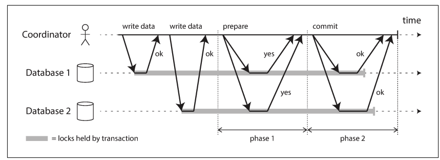

**Catalog**

- [Triển khai phát sóng theo thứ tự toàn phần bằng lưu trữ tuyến tính](#trin-khai-phát-sóng-theo-th-t-toàn-phn-bng-lu-tr-tuyn-tính)
- [Giao dịch phân tán và Đồng thuận](#giao-dch-phân-tán-và-ng-thun)
- [Two-Phase Commit 2PC](#twophase-commit-2pc)
- [Three-phase commit](#threephase-commit)
- [In fact](#in-fact)
- [Các thuộc tính của một thuật toán đồng thuận:](#các-thuc-tính-ca-mt-thut-toán-ng-thun)
- [Membership and Coordination Services](#membership-and-coordination-services)

---

## Triển khai phát sóng theo thứ tự toàn phần bằng lưu trữ tuyến tính

- Thuật toán rất đơn giản: với mỗi thông điệp bạn muốn gửi qua phát sóng theo thứ tự toàn phần, bạn thực hiện increment-and-get trên thanh ghi tuyến tính, rồi gắn giá trị nhận được vào thông điệp như một số thứ tự. Sau đó bạn gửi thông điệp đến tất cả các nút (và gửi lại nếu bị mất), và các nút sẽ xử lý thông điệp theo đúng thứ tự số thứ tự.
- Lưu ý rằng không giống như Lamport timestamps, các số nhận được từ thao tác increment này không có khoảng trống. Vì vậy, nếu một nút đã xử lý thông điệp số 4 và nhận được thông điệp số 6, nó biết rằng cần phải đợi thông điệp số 5 trước khi xử lý số 6. Điều này không đúng với timestamp của Lamport — và đây chính là điểm khác biệt then chốt giữa phát sóng theo thứ tự toàn phần và sắp xếp theo timestamp.

## Giao dịch phân tán và Đồng thuận

- Đồng thuận (consensus) là một trong những vấn đề quan trọng và nền tảng nhất trong lĩnh vực tính toán phân tán
- Nhìn bề ngoài, nó có vẻ đơn giản: nói một cách không chính thức, mục tiêu chỉ đơn giản là làm sao để nhiều nút cùng đồng ý với nhau về một điều gì đó. Bạn có thể nghĩ rằng điều này không quá khó. Tuy nhiên, đã có rất nhiều hệ thống bị lỗi do sai lầm khi nghĩ rằng bài toán này dễ giải quyết.
- Có thể bạn đã từng nghe đến định lý FLP [68] – được đặt tên theo ba tác giả Fischer, Lynch và Paterson – chứng minh rằng không tồn tại thuật toán nào luôn có thể đạt được đồng thuận nếu có khả năng một nút bị sập (crash)
- Trong một hệ thống phân tán, ta phải giả định rằng các nút có thể bị sập, do đó đồng thuận đáng tin cậy là điều không thể
- mặc dù định lý FLP là một phát hiện có ý nghĩa lý thuyết lớn, trong thực tế, các hệ thống phân tán vẫn có thể đạt được đồng thuận.

## Two-Phase Commit 2PC

  

- Với những giao dịch thực thi tại một nút cơ sở dữ liệu duy nhất, tính nguyên tử thường được bộ lưu trữ (storage engine) thực hiện.
    - Trong trường hợp này, một thiết bị duy nhất (bộ điều khiển của ổ đĩa cụ thể, gắn với một nút cụ thể) quyết định tính nguyên tử của việc commit.
- nếu nhiều nút cùng tham gia vào một giao dịch
    - Một số nút có thể phát hiện xung đột hoặc vi phạm ràng buộc và cần phải huỷ bỏ, trong khi các nút khác vẫn có thể commit thành công.
    - Một số yêu cầu commit có thể bị mất trong mạng và cuối cùng bị huỷ do timeout, trong khi các yêu cầu khác lại tới nơi bình thường.
    - Một số nút có thể bị sập trước khi ghi xong bản ghi commit và sẽ rollback khi khôi phục, trong khi những nút khác đã commit thành công.
- Nếu một số nút commit giao dịch, còn các nút khác lại huỷ, thì hệ thống sẽ bị mất nhất quán
- một khi giao dịch đã được commit ở một nút thì không thể thu hồi lại, ngay cả khi sau này phát hiện nó bị huỷ ở nơi khác.
- Vì lý do đó, một nút chỉ được phép commit khi nó chắc chắn rằng tất cả các nút khác cũng sẽ commit.

### Cách hoạt động của 2PC

- thành phần mới không có trong các giao dịch đơn nút: coordinator (bộ điều phối), hay còn gọi là trình quản lý giao dịch (transaction manager)
- Coordinator thường được triển khai dưới dạng thư viện trong cùng tiến trình ứng dụng
- Khi ứng dụng sẵn sàng commit, coordinator bắt đầu Pha 1:
    - Gửi yêu cầu prepare đến từng nút, hỏi xem chúng có sẵn sàng commit không.
    - Coordinator theo dõi các phản hồi từ các participant.
- Nếu:
    - Tất cả các participant trả lời “có” (sẵn sàng commit), thì coordinator sẽ gửi yêu cầu commit trong Pha 2, và giao dịch được thực hiện.
    - Bất kỳ participant nào trả lời “không”, thì coordinator gửi yêu cầu huỷ đến tất cả các nút trong Pha 2.
- Rõ ràng là các yêu cầu prepare và commit trong 2PC cũng có thể bị mất như trong one-phase. Vậy điều gì khiến 2PC khác biệt?  quy trình chi tiết
    - Khi ứng dụng muốn bắt đầu một giao dịch phân tán, nó yêu cầu một transaction ID từ coordinator (trình điều phối). ID này là duy nhất toàn cục.
    - Ứng dụng bắt đầu một giao dịch đơn nút tại mỗi nút tham gia (participant), và đính kèm transaction ID vào từng giao dịch. Mọi thao tác đọc/ghi sẽ thực hiện bên trong các giao dịch đơn nút đó. Nếu có bất kỳ sự cố nào xảy ra trong giai đoạn này (ví dụ: một nút bị sập hoặc yêu cầu bị timeout), coordinator hoặc bất kỳ participant nào đều có thể abort.
    - Khi ứng dụng đã sẵn sàng để commit, coordinator gửi yêu cầu prepare tới tất cả các participant, kèm theo transaction ID. Nếu bất kỳ yêu cầu nào trong số này bị lỗi hoặc timeout, coordinator sẽ gửi yêu cầu abort cho tất cả các participant.
    - Khi một participant nhận được yêu cầu prepare, nó phải đảm bảo rằng mình chắc chắn có thể commit giao dịch trong mọi hoàn cảnh. Điều này bao gồm việc ghi tất cả dữ liệu giao dịch xuống đĩa (crash, mất điện, hoặc đầy bộ nhớ không phải là lý do hợp lệ để từ chối commit sau này), và kiểm tra xung đột hoặc vi phạm ràng buộc. Khi trả lời “yes”, participant đã hứa là sẽ commit mà không lỗi, nếu được yêu cầu. Nói cách khác, participant đã từ bỏ quyền abort, nhưng chưa thực sự commit.
    - Khi coordinator đã nhận đủ phản hồi từ tất cả các prepare requests, nó sẽ đưa ra quyết định cuối cùng là commit hay abort giao dịch (chỉ commit nếu tất cả participant đều trả lời “yes”). Coordinator phải ghi lại quyết định này vào transaction log trên đĩa, để khi nó bị crash và khởi động lại, nó vẫn biết mình đã quyết định thế nào. Đây được gọi là điểm commit (commit point).
    - Sau khi quyết định của coordinator đã được ghi xuống đĩa, yêu cầu commit hoặc abort sẽ được gửi tới tất cả các participant. Nếu một yêu cầu thất bại hoặc timeout, coordinator phải retry mãi mãi cho đến khi thành công. Không còn đường quay lại: nếu quyết định là commit, thì quyết định đó phải được thực hiện bằng mọi giá, kể cả sau nhiều lần thử lại. Nếu một participant bị crash, giao dịch sẽ được commit khi nó phục hồi — vì nó đã vote “yes” trước đó, nên không thể từ chối commit khi trở lại.
- Do đó, giao thức này có hai điểm không thể quay đầu quan trọng:
    - Khi một participant trả lời “yes” trong bước prepare, nghĩa là nó cam kết sẽ commit về sau;
    - Khi coordinator đưa ra quyết định cuối cùng, quyết định đó là không thể đảo ngược.
- Sự cố với Coordinator
    - Nếu coordinator bị lỗi trước khi gửi yêu cầu prepare, thì participant có thể abort an toàn.
    - Nhưng một khi participant đã nhận được prepare và trả lời “yes”, nó không còn quyền abort đơn phương — nó phải chờ coordinator quyết định commit hay abort.
        - Nếu coordinator bị crash (hoặc mạng gặp sự cố) vào thời điểm này, participant không thể làm gì ngoài việc chờ đợi. Giao dịch tại participant này được gọi là in doubt (bị nghi ngờ) hoặc uncertain.
        -   

## Three-phase commit

- Cam kết hai pha (2PC) được gọi là giao thức cam kết nguyên tử dạng chặn (blocking atomic commit protocol) bởi vì nó có thể bị kẹt khi coordinator bị sự cố và phải đợi phục hồi
- 3PC giả định rằng mạng có độ trễ giới hạn và các nút có thời gian phản hồi giới hạn; trong hầu hết các hệ thống thực tế có độ trễ mạng không giới hạn và ngắt quãng xử lý, nó không thể đảm bảo tính nguyên tử (atomicity).

## In fact

- Một số cách triển khai giao dịch phân tán mang lại chi phí hiệu năng rất lớn — ví dụ, giao dịch phân tán trong MySQL được báo cáo là chậm hơn 10 lần so với giao dịch trên một nút đơn [87]. Không có gì ngạc nhiên khi nhiều người khuyên tránh sử dụng chúng. Phần lớn chi phí hiệu năng trong 2PC là do:
    - Việc ép ghi xuống đĩa (fsync) cần thiết để khôi phục sau sự cố,
    - Số lần round-trip qua mạng tăng thêm.
- hai loại giao dịch phân tán rất khác nhau
    - Giao dịch phân tán nội bộ trong cơ sở dữ liệu
        - Một số cơ sở dữ liệu phân tán (tức là sử dụng replication và partitioning theo mặc định) hỗ trợ giao dịch nội bộ giữa các nút của cùng một cơ sở dữ liệu. Ví dụ: VoltDB và MySQL Cluster (bộ lưu trữ NDB) có hỗ trợ loại giao dịch này. Trong trường hợp này, tất cả các nút đều chạy cùng một phần mềm cơ sở dữ liệu.
        - ➡ Những giao dịch này không cần tương thích với bất kỳ hệ thống nào khác, do đó có thể dùng các giao thức và tối ưu hóa chuyên biệt. Vì vậy, chúng thường hoạt động khá hiệu quả.
    - Giao dịch phân tán dị thể (Heterogeneous distributed transactions)
        - Trong một giao dịch dị thể, các participant là hai hoặc nhiều công nghệ khác nhau — ví dụ: hai cơ sở dữ liệu từ các nhà cung cấp khác nhau, hoặc các hệ thống phi cơ sở dữ liệu như message broker. Giao dịch phân tán này cần đảm bảo cam kết nguyên tử dù các hệ thống rất khác nhau bên trong.
        - ➡ Những giao dịch này khó khăn hơn rất nhiề

### Exactly-once message processing

- Giao dịch phân tán dị thể cho phép kết hợp các hệ thống khác nhau một cách mạnh mẽ
    - Một thông điệp từ message queue chỉ được đánh dấu là “đã xử lý” nếu và chỉ nếu giao dịch cơ sở dữ liệu tương ứng đã commit thành công.
    - Điều này đạt được bằng cách cam kết nguyên tử cả việc xác nhận thông điệp và ghi cơ sở dữ liệu trong cùng một giao dịch.

### X/Open XA (viết tắt của eXtended Architecture)

- là một tiêu chuẩn để triển khai cam kết hai pha trên các công nghệ dị thể
- XA không phải là một giao thức mạng — nó chỉ là API bằng C để tương tác với coordinator. Có binding cho nhiều ngôn ngữ khác
- XA giả định rằng ứng dụng dùng một driver mạng hoặc thư viện client để giao tiếp với database hoặc message service.
    - Nếu driver hỗ trợ XA, nó sẽ dùng XA API để biết một thao tác có nằm trong giao dịch phân tán hay không.
    - Nếu có, driver sẽ gửi thông tin cần thiết đến server.
    - Driver cũng cung cấp các callback để coordinator có thể yêu cầu participant chuẩn bị (prepare), commit hoặc abort.
- Coordinator sẽ thực hiện XA API
    - Nó theo dõi các participant của một giao dịch.
    - Thu thập phản hồi sau bước prepare (qua callback).
    - Ghi log xuống đĩa cục bộ để lưu quyết định commit/abort.
- Nếu tiến trình ứng dụng crash, hoặc máy chủ bị tắt đột ngột, coordinator cũng chết theo.
    - Các participant đã prepare nhưng chưa commit sẽ mắc kẹt trong trạng thái nghi ngờ.

### Giữ khóa trong khi đang nghi vấn

- Tại sao chúng ta lại lo lắng nhiều đến vậy về một giao dịch bị kẹt ở trạng thái nghi vấn? Chẳng lẽ phần còn lại của hệ thống không thể tiếp tục hoạt động, và bỏ qua giao dịch đang nghi vấn đó – vốn sẽ được dọn dẹp sau này?
    - Vấn đề nằm ở việc khóa dữ liệu.
    - khi sử dụng giao thức hai pha (2PC), một giao dịch phải giữ các khóa đó trong suốt thời gian bị nghi vấn. Nếu trình điều phối (coordinator) bị sập và mất 20 phút để khởi động lại, thì các khóa sẽ bị giữ trong suốt 20 phút đó.
    - Nếu nhật ký của coordinator bị mất hoàn toàn vì lý do nào đó, các khóa có thể bị giữ vĩnh viễn – hoặc ít nhất cho đến khi quản trị viên can thiệp thủ công để xử lý.

### Khôi phục sau khi coordinator bị lỗi

- Về lý thuyết, nếu coordinator bị lỗi và sau đó được khởi động lại, nó sẽ khôi phục lại trạng thái từ nhật ký và xử lý mọi giao dịch nghi vấn
-  trên thực tế, đôi khi vẫn có những giao dịch nghi vấn bị mồ côi (orphaned transactions)
    - tức là các giao dịch mà coordinator không thể quyết định kết quả vì một lý do nào đó (ví dụ: do nhật ký bị mất hoặc hỏng do lỗi phần mềm)
    - sẽ tồn tại vĩnh viễn trong cơ sở dữ liệu, giữ khóa và chặn các giao dịch khác.
    - gay cả khi khởi động lại máy chủ cơ sở dữ liệu cũng không khắc phục được, bởi vì một triển khai đúng của 2PC phải bảo toàn các khóa của giao dịch nghi vấn ngay cả sau khi khởi động lại
    - Cách duy nhất để thoát khỏi tình trạng này là quản trị viên phải can thiệp thủ công, quyết định có nên commit hay rollback các giao dịch
- trình điều phối giao dịch (coordinator) thực chất cũng là một loại cơ sở dữ liệu
    - Nếu coordinator không được sao lưu hoặc chỉ chạy trên một máy, thì nó trở thành điểm lỗi đơn lẻ (single point of failure) cho toàn bộ hệ thống (vì nếu nó sập, các ứng dụng khác sẽ bị treo do khóa bị giữ bởi các giao dịch nghi vấn)
    - Nhiều ứng dụng phía server hiện nay được xây dựng theo mô hình không trạng thái (stateless) (như trong HTTP), với toàn bộ trạng thái bền được lưu trong cơ sở dữ liệu – điều này giúp có thể dễ dàng thêm hoặc xoá server. Nhưng nếu coordinator là một phần trong ứng dụng, điều này sẽ thay đổi bản chất triển khai. 
        - Nhật ký của coordinator trở thành một phần quan trọng trong hệ thống bền vững, tương đương với dữ liệu trong cơ sở dữ liệu – vì các nhật ký này là cần thiết để phục hồi giao dịch sau khi xảy ra lỗi. 
        - Lúc đó, server ứng dụng không còn là stateless nữa.
    - Vì XA cần tương thích với nhiều loại hệ thống dữ liệu khác nhau, nên nó phải hoạt động theo nguyên tắc mẫu số chung thấp nhất
        - Ví dụ: nó không thể phát hiện deadlock xuyên hệ thống (vì điều đó cần có một giao thức chuẩn để các hệ thống chia sẻ thông tin về các khóa mà mỗi giao dịch đang chờ), và nó không hoạt động được với SSI (Serializable Snapshot Isolation – xem trang 261), vì điều đó cần giao thức nhận diện xung đột giữa các hệ thống khác nhau.
    - Với giao dịch phân tán nội bộ trong cơ sở dữ liệu (không phải XA), những hạn chế này không quá nghiêm trọng – ví dụ: có thể triển khai SSI phân tán. Tuy nhiên, vấn đề vẫn là với 2PC, mọi bên tham gia đều phải phản hồi, nếu không, giao dịch sẽ thất bại. Do đó, nếu bất kỳ thành phần nào của hệ thống bị lỗi, toàn bộ giao dịch cũng sẽ thất bại. Giao dịch phân tán có xu hướng khuếch đại lỗi, điều này đi ngược lại mục tiêu xây dựng hệ thống chịu lỗi.

## Các thuộc tính của một thuật toán đồng thuận:

- Thỏa thuận thống nhất (Uniform Agreement): Không có hai nút nào đưa ra quyết định khác nhau.
- Toàn vẹn (Integrity): Không nút nào được quyết định hai lần.
- Tính hợp lệ (Validity): Nếu một nút quyết định giá trị v, thì v phải là giá trị đã được một nút nào đó đề xuất.
- Kết thúc (Termination): Mỗi nút không bị sự cố cuối cùng phải đưa ra một quyết định.
- Hai thuộc tính đầu tiên thể hiện ý tưởng cốt lõi của đồng thuận: tất cả đều quyết định giống nhau, và một khi đã quyết định thì không được thay đổi. Tính hợp lệ đảm bảo rằng các quyết định không phải là tùy tiện
- Nếu không cần quan tâm đến khả năng chịu lỗi, việc thoả mãn ba thuộc tính đầu là dễ: chỉ cần gán cứng một nút làm “nhà độc tài” để đưa ra mọi quyết định
- Tuy nhiên, nếu nút đó bị lỗi, hệ thống không thể đưa ra quyết định nữa—điều này chính là những gì đã thấy trong giao thức Two-Phase Commit (2PC): nếu điều phối viên (coordinator) bị lỗi, các nút tham gia sẽ bị kẹt mà không thể quyết định commit hay abort.
- Thuộc tính termination là hiện thân của khả năng chịu lỗi: thuật toán không được phép ngồi chờ mãi mà không làm gì. Dù một vài nút có thể bị lỗi, những nút còn lại vẫn phải có khả năng đưa ra quyết định.

### Mô hình hệ thống của đồng thuận

- Mô hình hệ thống giả định rằng khi một nút “crash”, nó biến mất và không bao giờ quay lại.
- Trong mô hình này, bất kỳ thuật toán nào cần chờ nút phục hồi sẽ không thoả mãn được thuộc tính kết thúc. Ví dụ, 2PC không thoả mãn termination.
- Tất nhiên, nếu tất cả các nút bị lỗi, thì không có thuật toán nào có thể quyết định bất kỳ điều gì. Có thể chứng minh rằng mọi thuật toán đồng thuận phải có ít nhất đa số nút (majority) còn hoạt động để đảm bảo thuộc tính termination. Số lượng đa số đó có thể được xem là một quorum

### Đánh số epoch và nhóm biểu quyết (quorum)

- Tất cả các giao thức đồng thuận (consensus) được đề cập đến cho đến giờ đều sử dụng một dạng leader nào đó ở bên trong, nhưng chúng không đảm bảo rằng leader là duy nhất
- Thay vào đó, chúng đưa ra một đảm bảo yếu hơn: các giao thức này định nghĩa một số epoch và đảm bảo rằng trong mỗi epoch, leader là duy nhất.
- Mỗi khi leader hiện tại bị cho là đã chết, các node sẽ bắt đầu một cuộc bầu chọn để chọn ra một leader mới. Cuộc bầu chọn này được gán một số epoch tăng lên, và như vậy các số epoch được sắp xếp hoàn toàn và luôn tăng dần. Nếu có xung đột giữa hai leader khác nhau ở hai epoch khác nhau (có thể do leader trước đó thật ra chưa chết), thì leader với số epoch cao hơn sẽ thắng thế.
- Trước khi một leader được phép quyết định điều gì đó, nó phải kiểm tra rằng không có leader nào khác với số epoch cao hơn có thể ra quyết định mâu thuẫn.
    - một node không thể chỉ tin vào nhận định của chính nó — việc một node nghĩ rằng nó là leader không có nghĩa là các node khác cũng công nhận nó là leader.
    - Thay vào đó, node đó phải thu thập đủ số phiếu từ một quorum (nhóm biểu quyết) của các node
- Quy trình bỏ phiếu này thoạt nhìn giống với two-phase commit. Tuy nhiên, có vài điểm khác biệt lớn: trong 2PC, coordinator (điều phối viên) không được bầu chọn, và các giao thức đồng thuận chịu lỗi chỉ yêu cầu phiếu đồng ý từ đa số các node, trong khi 2PC yêu cầu tất cả các node tham gia phải đồng ý

## Membership and Coordination Services

- Các dự án như ZooKeeper hoặc etcd thường được mô tả là “các khoá-giá trị phân tán” hoặc “dịch vụ cấu hình và điều phối”
- API của một dịch vụ như vậy khá giống với API của một cơ sở dữ liệu: bạn có thể đọc và ghi giá trị cho một khoá cụ thể, và lặp qua các khoá. Vậy nếu chúng về cơ bản giống cơ sở dữ liệu, tại sao lại phải mất công triển khai thuật toán đồng thuận? Điều gì làm chúng khác biệt so với các loại cơ sở dữ liệu khác?
- hiếm khi cần sử dụng ZooKeeper một cách trực tiếp, vì thực ra nó không phù hợp để làm cơ sở dữ liệu tổng quát. Thay vào đó, bạn có khả năng sẽ sử dụng gián tiếp thông qua các dự án khác: ví dụ như HBase, Hadoop YARN, OpenStack Nova và Kafka đều phụ thuộc vào ZooKeeper đang chạy ngầm. Vậy, các dự án này nhận được gì từ ZooKeeper?
    - ZooKeeper và etcd được thiết kế để lưu trữ một lượng dữ liệu nhỏ có thể hoàn toàn nằm trong bộ nhớ (mặc dù vẫn ghi ra đĩa để đảm bảo tính bền vững) — do đó bạn sẽ không muốn lưu trữ toàn bộ dữ liệu của ứng dụng vào đây
    - Lượng dữ liệu nhỏ đó được sao chép qua tất cả các nút bằng một thuật toán truyền phát theo thứ tự tổng thể chịu lỗi
    - nếu mỗi thông điệp đại diện cho một thao tác ghi, áp dụng các thao tác ghi theo cùng một thứ tự sẽ giữ cho các bản sao nhất quán với nhau.
- ZooKeeper được mô phỏng theo dịch vụ khoá Chubby của Google,, các tính năng khác rất hữu ích khi xây dựng các hệ thống phân tán:
    - Các thao tác nguyên tử tuyến tính (**Linearizable atomic operations**)
        - Bằng cách sử dụng thao tác so sánh-và-thiết-lập (compare-and-set) nguyên tử, bạn có thể triển khai một khoá (lock): nếu nhiều nút cố gắng thực hiện cùng một thao tác đồng thời, chỉ một trong số chúng sẽ thành công.
        - Một khoá phân tán thường được triển khai dưới dạng một lease (hợp đồng tạm thời), có thời gian hết hạn để tự động giải phóng trong trường hợp client bị lỗi
    - Thứ tự tổng thể của các thao tác (**Total ordering of operations**)
        - Token rào chắn là một số tăng dần mỗi lần khoá được cấp. ZooKeeper cung cấp điều này bằng cách sắp xếp hoàn toàn tất cả các thao tác và gán cho mỗi thao tác một ID giao dịch (zxid) và số phiên bản (cversion) tăng dần.
    - Phát hiện lỗi (**Failure detection**)
        - Client duy trì một phiên lâu dài với các server ZooKeeper, và client cùng server định kỳ trao đổi tín hiệu "heartbeat" để kiểm tra xem bên kia còn sống không. 
        - Ngay cả khi kết nối bị gián đoạn tạm thời, hoặc một nút ZooKeeper gặp lỗi, phiên vẫn được giữ nguyên. Tuy nhiên, nếu các heartbeat dừng lại trong một thời gian dài hơn timeout của phiên, ZooKeeper sẽ coi phiên đó đã chết.
        - Bất kỳ khoá nào do phiên đó nắm giữ có thể được cấu hình để tự động giải phóng khi phiên hết hạn
    - Thông báo thay đổi (**Change notifications**)\
        - Không chỉ có thể đọc các khoá và giá trị được tạo bởi client khác, một client còn có thể “watch” (theo dõi) các khoá đó để nhận thông báo khi có thay đổi
        - Do do, một client có thể phát hiện khi một client khác gia nhập cụm (dựa trên giá trị nó ghi vào ZooKeeper), hoặc khi một client khác thất bại (do phiên hết hạn và các ephemeral node biến mất).

### Phân bổ công việc cho các nút (Allocating work to nodes)

- Một ví dụ trong đó mô hình ZooKeeper/Chubby hoạt động tốt là khi bạn có nhiều instance (phiên bản) của một tiến trình hoặc dịch vụ, và một trong số chúng cần được chọn làm leader (lãnh đạo) hoặc primary (chính)
- Việc thực hiện các cuộc bỏ phiếu đa số trên quá nhiều nút sẽ vô cùng kém hiệu quả. Thay vào đó, ZooKeeper chạy trên một số lượng nút cố định (thường là ba hoặc năm) và thực hiện các cuộc bỏ phiếu đa số giữa những nút đó trong khi vẫn hỗ trợ một số lượng lớn các client.
-  Vì vậy, ZooKeeper cung cấp một cách để "outsourcing" (thuê ngoài) một phần công việc điều phối các nút (đồng thuận, sắp xếp các thao tác, và phát hiện lỗi) cho một dịch vụ bên ngoài.
- Thông thường, loại dữ liệu được quản lý bởi ZooKeeper thay đổi rất chậm: nó đại diện cho thông tin như “nút chạy trên 10.1.1.23 là leader cho phân vùng 7,” điều này có thể thay đổi theo thang thời gian của phút hoặc giờ. Nó không được thiết kế để lưu trữ trạng thái runtime (thời gian chạy) của ứng dụng, thứ có thể thay đổi hàng nghìn hoặc thậm chí triệu lần mỗi giây. N

### Service discovery

- Trong các môi trường trung tâm dữ liệu đám mây, nơi mà các máy ảo thường xuyên gia nhập và rời đi, bạn thường không biết trước địa chỉ IP của các dịch vụ. Thay vào đó, bạn có thể cấu hình các dịch vụ của mình sao cho khi chúng khởi động, chúng sẽ đăng ký các điểm cuối mạng (network endpoints) của mình vào một registry dịch vụ, nơi chúng có thể được tìm thấy bởi các dịch vụ khác.
