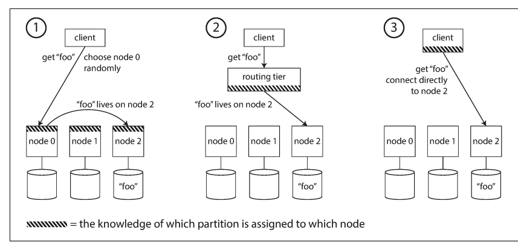

**Catalog**

1. [Partition](#partition)
    - [Key Range Partitioning](#key-range-partitioning)
    - [Partitioning by Hash of Key](#partitioning-by-hash-of-key)
    - [Secondary Indexes](#secondary-indexes)
    - [Rebalancing Partitions](#rebalancing-partitions)
    - [Request routing](#request-routing)
    - [Parallel Query execution](#parallel-query-execution)
2. [Transactions](#transactions)
    - [Weak Isolation Levels](#weak-isolation-levels)
    - [Read committed](#read-committed)
    - [Snapshot Isolation & Repeatable Read](#snapshot-isolation--repeatable-read)
    - [Automatically detecting lost updates](#automatically-detecting-lost-updates)
    - [Compare-and-set](#compareandset)
    - [Conflict resolution and replication](#conflict-resolution-and-replication)
    - [Write Skew and Phantoms](#write-skew-and-phantoms)
    - [Materializing conflicts](#materializing-conflicts)
    - [Serializability](#serializability)

---

# Partition

- nếu việc partitioning không công bằng, một số partitioning có nhiều dữ liệu hoặc nhiều truy vấn hơn những partitioning khác, ta gọi đó là hiện tượng lệch tải (skew). 
- Trong trường hợp xấu nhất, tất cả truy vấn dồn về một partitioning duy nhất, khiến node đó trở thành nút thắt cổ chai (bottleneck), còn các node khác thì rảnh rỗi
- Partitioning bị quá tải như vậy được gọi là "điểm nóng" (hot spot).  

## Key Range Partitioning

- có thể giữ các khóa trong thứ tự sắp xếp, giúp cho quét theo dải (range scan) trở nên dễ dàng
- Nhược điểm là nếu khóa là dấu thời gian, thì mọi ghi dữ liệu mới đều đổ về Partitioning hiện tại (hôm nay), khiến nó trở thành điểm nóng

## Partitioning by Hash of Key

- Vì nguy cơ xảy ra lệch tải (skew) và điểm nóng (hot spot), nhiều hệ thống cơ sở dữ liệu phân tán hiện nay sử dụng hàm băm (hash function) để xác định một khóa (key) thuộc về Partitioning nào
- Với mục đích Partitioning, hàm băm không cần phải là hàm mã hóa an toàn 
- Nhược điểm lớn của cách này là mất đi khả năng truy vấn theo khoảng (range query) như trong Partitioning theo khoảng khóa
- Cassandra đưa ra một cách kết hợp giữa hai phương pháp Partitioning:
    - Một bảng trong Cassandra có thể khai báo khóa chính phức hợp (compound primary key) gồm nhiều cột.
    - Chỉ phần đầu tiên của khóa được băm để xác định Partitioning.
    - Các cột còn lại được dùng như một chỉ mục nối (concatenated index) để sắp xếp dữ liệu trong SSTables.

- Dùng hàm băm có thể giảm điểm nóng, nhưng không loại bỏ hoàn toàn. Trong trường hợp cực đoan, mọi truy vấn đều nhằm vào cùng một khóa, thì tất cả vẫn bị dồn về một Partitioning.
- Điều này hiếm gặp nhưng vẫn có thể xảy ra, ví dụ:
    - Một người nổi tiếng trên mạng xã hội có hàng triệu người theo dõi. Khi họ đăng bài, hàng triệu hành động (like, share, comment) sẽ dồn vào cùng một khóa (ví dụ ID của người dùng đó hoặc ID bài viết).
    - Lúc này, việc băm khóa không giúp gì cả, vì khóa giống nhau thì giá trị băm cũng giống nhau.
- Hiện nay, hầu hết các hệ thống dữ liệu không thể tự động xử lý kiểu tải lệch cực đoan như vậy, nên ứng dụng cần tự xử lý
    - Thêm một số ngẫu nhiên vào đầu hoặc cuối khóa nóng.
    - điều này có hậu quả:
        - Truy vấn đọc phải đọc từ tất cả 100 khóa và gộp lại.
        - Cần quản lý thêm: chỉ nên áp dụng với một số ít khóa nóng, nếu không sẽ gây lãng phí cho các khóa bình thường.

## Secondary Indexes

- chỉ mục phụ không dễ dàng gắn liền với các Partitioning dữ liệu
- Có hai hướng tiếp cận chính để Partitioning cơ sở dữ liệu khi dùng chỉ mục phụ:
    - Partitioning theo tài liệu (**Document-based Partitioning**)
    - Partitioning theo từ khóa (**Term-based Partitioning**)

### Document-based Partitioning (local index)

- những records có chung Secondary indexes có thể nằm rải rác ở nhiều partitioning
- phải gửi truy vấn đến tất cả các Partitioning, rồi tổng hợp kết quả.
- Cách truy vấn như vậy gọi là **scatter/gather** – có thể tốn tài nguyên và dễ bị ảnh hưởng bởi độ trễ "đuôi" (**tail latency amplification**)

### Term-based Partitioning (global index)
 
- không thể đặt toàn bộ chỉ mục trên một nút, vì nó sẽ trở thành nút thắt cổ chai.
- chỉ mục toàn cục cũng phải được phân mảnh, và cách phân mảnh có thể khác với cách phân mảnh dữ liệu chính.
- từ khóa tìm kiếm quyết định phân mảnh nào chứa chỉ mục đó
- Ưu điểm:
    - Đọc từ chỉ mục toàn cục hiệu quả hơn.
    - Không cần scatter/gather – chỉ cần gửi truy vấn đến phân mảnh chứa từ khóa cần tìm.
- Nhược điểm:
    - Ghi dữ liệu trở nên chậm và phức tạp hơn.
    - Vì một tài liệu có thể chứa nhiều từ khóa, mỗi từ có thể thuộc một phân mảnh khác nhau => một lần ghi có thể ảnh hưởng đến nhiều phân mảnh chỉ mục.
- Lý tưởng nhất, chỉ mục phải được cập nhật ngay khi có thay đổi, nhưng điều này đòi hỏi Transaction phân tán (distributed transaction) giữa các phân mảnh
- Thực tế, các chỉ mục toàn cục thường được cập nhật bất đồng bộ (asynchronous). Tức là, nếu bạn đọc chỉ mục ngay sau khi ghi, chưa chắc đã thấy thay đổi mới nhất.

## Rebalancing Partitions

  

`Quá trình di chuyển tải từ một nút trong cụm sang nút khác được gọi là cân bằng lại (rebalancing).`

### How not to do it: hash mod N

- hash(key) mod 10 sẽ trả về một số từ 0 đến 9, vậy nếu có 10 nút (node), ta có thể dễ dàng gán mỗi khóa cho một nút. Vấn đề là: nếu số nút N thay đổi, hầu hết các khóa sẽ phải chuyển sang nút khác.

### Fixed number of partitions

- tạo nhiều Partitioning hơn số lượng nút, và gán nhiều Partitioning cho mỗi nút
- Khi thêm nút mới vào cụm, nút đó sẽ “lấy” một số Partitioning từ các nút hiện tại để phân phối lại tải. Nếu một nút bị gỡ bỏ, quá trình diễn ra ngược lại.
- Chỉ cần di chuyển toàn bộ Partitioning, không cần thay đổi cách gán khóa vào Partitioning. 
- Điều duy nhất thay đổi là việc gán Partitioning cho các nút, và điều này không diễn ra ngay lập tức – cần thời gian để truyền dữ liệu qua mạng. Trong lúc đó, hệ thống vẫn sử dụng gán Partitioning cũ để xử lý yêu cầu.
- Ưu điểm: có thể phân bổ nhiều Partitioning hơn cho những nút mạnh hơn để chúng gánh tải nhiều hơn.
- Nhược điểm
    - nếu số lượng Partitioning quá nhỏ, việc mở rộng cụm sẽ bị giới hạn. 
    - Nhưng nếu quá nhiều Partitioning, sẽ tốn nhiều tài nguyên quản lý. 
    - Vậy nên phải chọn số lượng Partitioning vừa phải, đủ dùng cho hiện tại và tương lai.

### Dynamic partitioning

- Với các hệ thống Partitioning theo dải khóa (key range) như HBase hay RethinkDB, việc dùng số lượng Partitioning cố định là không tiện, vì nếu chia sai ranh giới, có thể toàn bộ dữ liệu sẽ dồn vào một Partitioning.
- Thay vào đó, các hệ thống này tạo Partitioning một cách động
    - Khi một Partitioning vượt quá kích thước cấu hình (ví dụ HBase là 10GB), nó sẽ bị tách đôi.
    - Ngược lại, nếu dữ liệu bị xóa nhiều và Partitioning trở nên quá nhỏ, nó sẽ gộp lại với Partitioning lân cận.

### Partitioning proportionally to nodes

- Một cách khác (như trong Cassandra, Ketama) là tạo số lượng Partitioning tỷ lệ thuận với số nút — tức là mỗi nút có một số lượng Partitioning cố định
    - ví dụ Cassandra mặc định là 256 Partitioning mỗi nút
- Khi thêm nút mới:
    - Nó chọn ngẫu nhiên một số Partitioning hiện có để chia đôi.
    - Nó giữ một nửa, phần còn lại vẫn ở nút cũ.
    - Mặc dù chia ngẫu nhiên có thể dẫn đến sự không công bằng, nhưng trung bình trên nhiều Partitioning thì tải sẽ phân đều.

### Automatic or Manual Rebalancing

- Việc cân bằng lại xảy ra tự động hay cần thao tác thủ công?
    - **Hoàn toàn tự động**: Hệ thống tự quyết định khi nào cần chuyển partition từ node này sang node khác, không cần quản trị viên can thiệp.
    - **Hoàn toàn thủ công**: Quản trị viên chỉ định thủ công việc phân bổ partition cho các node, và chỉ thay đổi khi có hành động cụ thể từ người quản trị.
- 

## Request routing

`Làm sao client biết gửi yêu cầu đến node nào?`

  

- Có 3 cách phổ biến để định tuyến request
    - Gửi request đến bất kỳ node nào
        - Ví dụ qua load balancer kiểu round-robin.
        - Nếu node đó sở hữu partition, nó xử lý luôn.
        - Nếu không, nó forward request sang node thích hợp, nhận phản hồi, rồi trả lại cho client.
    - Có một tầng định tuyến riêng biệt
        - Client gửi tất cả request đến tầng routing (gọi là routing tier).
        - Routing tier biết node nào giữ partition tương ứng, nên sẽ chuyển tiếp request đúng chỗ.
        - Nó không xử lý request, chỉ định tuyến.
    - Client tự biết partition và node nào sở hữu
        - Client được trang bị thông tin Partitioning, có thể gửi trực tiếp đến đúng node, không qua trung gian.
- Dù cách nào, thì phần quyết định định tuyến (client / routing tier / node) phải biết thông tin mới nhất về việc partition thuộc về node nào.
    - Nếu không đồng bộ thông tin, request sẽ bị gửi sai chỗ.
- theo dõi việc phân phối partition
    - Sử dụng dịch vụ điều phối (coordination service) như ZooKeeper.
    - Dù dùng cách nào, client vẫn cần biết IP/port ban đầu để kết nối.
    - Vì IP ít thay đổi hơn Partitioning dữ liệu, nên DNS thường là đủ để xử lý việc này.

## Parallel Query execution

-  các hệ quản trị cơ sở dữ liệu quan hệ MPP (Massively Parallel Processing - xử lý song song quy mô lớn), thường dùng cho phân tích dữ liệu (analytics), lại tinh vi hơn rất nhiều về loại truy vấn mà chúng xử lý.
- Một truy vấn điển hình trong kho dữ liệu (data warehouse) thường bao gồm:
    - Join nhiều bảng,
    - Lọc (filtering) dữ liệu,
    - Nhóm (grouping) theo các thuộc tính,
    - Và tổng hợp (aggregation) số liệu.
-  Trình tối ưu hóa truy vấn trong hệ MPP sẽ phân chia truy vấn phức tạp này thành nhiều giai đoạn thực thi (execution stage) và phân vùng (partition) khác nhau, trong đó nhiều phần có thể chạy song song trên các node khác nhau trong cụm cơ sở dữ liệu.

# Transactions

- Các hệ thống không tuân thủ ACID thường được gọi là BASE:
    - Basically Available (Cơ bản luôn sẵn sàng),
    - Soft state (Trạng thái mềm, dễ thay đổi),
    - Eventual consistency (Nhất quán cuối cùng).
- ý tưởng về **consistency** này lại phụ thuộc vào logic của ứng dụng, và chính ứng dụng phải chịu trách nhiệm định nghĩa các giao dịch sao cho đảm bảo nhất quán. 
    - Đây không phải là điều mà cơ sở dữ liệu có thể đảm bảo: nếu ghi dữ liệu sai và vi phạm các quy tắc, cơ sở dữ liệu không thể ngăn cản
- không có **durability** hoàn hảo: nếu toàn bộ ổ cứng và các bản sao lưu đều bị phá hủy cùng lúc, cơ sở dữ liệu hoàn toàn bất lực.

## Weak Isolation Levels

- Lỗi đồng thời rất khó phát hiện qua kiểm thử, vì chúng chỉ xảy ra khi thời điểm thực thi "không may" trùng nhau
- Vì lý do đó, các cơ sở dữ liệu từ lâu đã cố gắng che giấu các vấn đề đồng thời khỏi nhà phát triển ứng dụng bằng cách cung cấp cách ly Transaction. 
    - Về mặt lý thuyết, cách ly giúp bạn "giả vờ" như không có sự đồng thời nào đang diễn ra
- Nhưng trong thực tế, cách ly không đơn giản như vậy. Cách ly mức **serializable** có cái giá về hiệu năng, và nhiều cơ sở dữ liệu không muốn trả giá đó
- Một bình luận thường thấy khi những vấn đề này bị phanh phui là: “Hãy dùng cơ sở dữ liệu ACID nếu bạn xử lý dữ liệu tài chính!” — nhưng câu đó chưa hoàn toàn đúng. 
    - Ngay cả nhiều hệ quản trị cơ sở dữ liệu quan hệ nổi tiếng (thường được coi là “ACID”) cũng sử dụng mức cách ly yếu, và do đó vẫn có thể gây ra các lỗi đó.

## Read committed

- đảm bảo hai điều:
    - Khi đọc dữ liệu từ cơ sở dữ liệu, bạn chỉ thấy các dữ liệu committed (không có đọc bẩn - **dirty reads**).
    - Khi ghi dữ liệu vào cơ sở dữ liệu, bạn chỉ ghi đè lên các giá trị committed (không có ghi bẩn - **dirty writes)**.

### No dirty reads

- một Transaction đã ghi dữ liệu vào cơ sở dữ liệu, nhưng chưa cam kết hay hủy bỏ. Nếu một Transaction khác có thể thấy dữ liệu chưa cam kết này, đó được gọi là đọc bẩn 
- Việc ngăn chặn đọc bẩn là hữu ích vì:
    - Nếu một Transaction cần cập nhật nhiều đối tượng, việc đọc bẩn có thể khiến Transaction khác thấy một phần cập nhật mà không thấy phần còn lại
    - Nếu một Transaction bị hủy, tất cả các thay đổi nó đã thực hiện cần được hoàn tác. Nếu cho phép đọc bẩn, một Transaction khác có thể thấy dữ liệu chuẩn bị hoàn tác

### No dirty writes

- nếu bản ghi đầu tiên thuộc một Transaction chưa cam kết, và bản ghi sau ghi đè lên dữ liệu đó, thì điều đó được gọi là ghi bẩn
- read committed phải ngăn ghi bẩn, thường bằng cách buộc Transaction thứ hai đợi Transaction thứ nhất cam kết hoặc hủy bỏ xong trước khi có thể ghi tiếp
- giúp tránh một số lỗi cạnh (race conditions)

### Implement 

- row-level locks
    - khi một Transaction muốn cập nhật một đối tượng (dòng hoặc tài liệu), nó phải giành quyền khóa đối tượng đó trước và giữ khóa cho đến khi cam kết hoặc hủy bỏ
    - Chỉ một Transaction có thể giữ khóa trên một đối tượng tại một thời điểm. Nếu một Transaction khác muốn ghi vào đối tượng đó, nó phải chờ cho đến khi Transaction đầu tiên hoàn tất
- Việc ngăn đọc bẩn thì khác
    - Một lựa chọn là cũng sử dụng khóa khi đọc – tức là một Transaction đọc cũng phải xin quyền khóa tạm thời, rồi trả khóa sau khi đọc xong. 
    - Điều này ngăn không cho đọc xảy ra khi dữ liệu đang ở trạng thái chưa cam kết.
    - Tuy nhiên, cách này không hiệu quả vì một Transaction ghi lâu có thể khiến rất nhiều Transaction đọc phải chờ, gây giảm hiệu suất và ảnh hưởng tới trải nghiệm người dùng.
    - Do đó, hầu hết cơ sở dữ liệu hiện đại không sử dụng khóa đọc để ngăn đọc bẩn
        - Thay vào đó, với mỗi đối tượng được ghi, cơ sở dữ liệu lưu cả giá trị cũ đã cam kết và giá trị mới do Transaction hiện tại tạo ra

## Snapshot Isolation & Repeatable Read

- vẫn có nhiều lỗi liên quan Read committed
    - Giả sử Alice có $1.000 tiết kiệm ở ngân hàng, chia đều vào hai tài khoản, mỗi cái $500. Giờ có một Transaction đang chuyển $100 từ một tài khoản sang tài khoản còn lại. Nếu Alice xem số dư tài khoản đúng vào lúc Transaction đang được xử lý, cô ấy có thể thấy:
        - Một tài khoản (chưa nhận tiền) vẫn có $500,
        - Trong khi tài khoản còn lại (đã bị trừ) chỉ còn $400.
    - Như vậy, Alice thấy tổng cộng cô chỉ còn $900 – như thể $100 đã biến mất vào không khí.
    - Hiện tượng này gọi là nonrepeatable read hoặc read skew (đọc sai lệch): nếu Alice đọc lại số dư tài khoản 1 sau khi Transaction kết thúc, cô sẽ thấy một giá trị khác ($600) so với lần đọc trước. 
    - Mức cách ly **read committed** cho phép điều này, vì các giá trị mà Alice thấy đều là đã được cam kết tại thời điểm cô đọc chúng.

### Snapshot Isolation

- Transaction chỉ nhìn thấy dữ liệu đã được cam kết tại thời điểm Transaction bắt đầu, ngay cả khi dữ liệu bị thay đổi sau đó bởi Transaction khác.
    - Điều này cực kỳ hữu ích cho các truy vấn chạy lâu và chỉ đọc, như sao lưu hoặc phân tích – vì thật khó để hiểu một truy vấn nếu dữ liệu thay đổi trong khi truy vấn đang chạy
- Người đọc không chặn người ghi, và người ghi không chặn người đọc.
- Snapshot isolation được triển khai dựa trên cơ chế đa phiên bản (**MVCC – Multi-Version Concurrency Control**). 
- Cơ sở dữ liệu sẽ lưu nhiều phiên bản dữ liệu của cùng một đối tượng, để các Transaction đang chạy có thể nhìn thấy trạng thái dữ liệu tại các thời điểm khác nhau.
    - Nếu chỉ cần read committed, có thể chỉ cần hai phiên bản: một đã cam kết và một chưa cam kết.
    - Nhưng để hỗ trợ snapshot isolation, hệ thống phải duy trì nhiều phiên bản hơn.

### consistent snapshot

- Khi bắt đầu mỗi Transaction, cơ sở dữ liệu lập một danh sách tất cả các Transaction khác đang diễn ra (chưa được cam kết hoặc hủy bỏ) tại thời điểm đó. Bất kỳ ghi chép nào mà các Transaction đó đã thực hiện sẽ bị bỏ qua, ngay cả khi sau đó chúng được cam kết.
- Bất kỳ ghi chép nào do các Transaction đã bị hủy bỏ thực hiện cũng bị bỏ qua.
- Bất kỳ ghi chép nào được tạo bởi các Transaction có ID lớn hơn (tức là bắt đầu sau Transaction hiện tại) sẽ bị bỏ qua, bất kể chúng đã được cam kết hay chưa.
- Tất cả các ghi chép khác đều hiển thị với các truy vấn của ứng dụng.

### Index with Snapshot isolation

- để chỉ mục trỏ tới tất cả các phiên bản của một đối tượng và yêu cầu truy vấn lọc ra các phiên bản không hiển thị với Transaction hiện tại.
- Khi quá trình gom rác (garbage collection) loại bỏ các phiên bản cũ không còn hiển thị với Transaction nào nữa, các mục trong chỉ mục liên quan cũng được loại bỏ. 

## Automatically detecting lost updates

- Các thao tác ACID và việc dùng khóa là những cách ngăn ngừa cập nhật bị mất bằng cách ép chu trình đọc-sửa-ghi phải thực hiện tuần tự. 
- Một cách tiếp cận khác là cho phép các chu trình đó thực thi song song, và nếu trình quản lý Transaction phát hiện một cập nhật bị mất, thì sẽ hủy bỏ Transaction và buộc nó thực hiện lại chu trình đọc-sửa-ghi.
- Ưu điểm của phương pháp này là cơ sở dữ liệu có thể thực hiện kiểm tra này hiệu quả khi dùng chung với snapshot isolation.

## Compare-and-set

- Trong những cơ sở dữ liệu không hỗ trợ Transaction, đôi khi có một thao tác ACID gọi là compare-and-set
- Mục tiêu của thao tác này là tránh mất cập nhật bằng cách chỉ cho phép cập nhật nếu giá trị chưa thay đổi kể từ lần bạn đọc cuối cùng. Nếu giá trị hiện tại khác với giá trị trước đó bạn đã đọc, cập nhật sẽ không có hiệu lực

## Conflict resolution and replication

- việc ngăn ngừa mất cập nhật có thêm một khía cạnh phức tạp: vì dữ liệu được sao chép trên nhiều nút, và dữ liệu có thể được cập nhật đồng thời trên các nút khác nhau, nên cần có các bước bổ sung để ngăn mất cập nhật.
- Các thao tác khóa và so sánh-đặt (compare-and-set) giả định rằng chỉ có một bản sao dữ liệu được cập nhật mới nhất. Tuy nhiên, các cơ sở dữ liệu sử dụng sao chép đa lãnh đạo (multi-leader) hoặc không lãnh đạo (leaderless) thường cho phép nhiều thao tác ghi xảy ra đồng thời và được sao chép không đồng bộ, nên không thể đảm bảo có một bản sao duy nhất được cập nhật mới nhất. Vì vậy, các kỹ thuật dựa trên khóa hoặc compare-and-set không thể áp dụng trong ngữ cảnh này
- một cách tiếp cận phổ biến trong các cơ sở dữ liệu sao chép là cho phép các ghi đồng thời tạo ra nhiều phiên bản xung đột của cùng một giá trị (còn gọi là siblings), và sử dụng mã ứng dụng hoặc các cấu trúc dữ liệu đặc biệt để giải quyết và gộp các phiên bản này sau đó.

## Write Skew and Phantoms

- ghi lệch (write skew): hai Transaction cập nhật hai đối tượng khác nhau nhưng vi phạm một **điều kiện tranh chấp**
    - Hành vi sai chỉ xảy ra vì Transaction chạy đồng thời.
- Solution
    - Thao tác ACID trên một đối tượng không giúp ích, vì nhiều đối tượng có liên quan.
    - Phát hiện tự động mất cập nhật trong một số cơ chế snapshot isolation cũng không giúp gì: ghi lệch không được phát hiện tự động
        - Muốn ngăn ghi lệch hoàn toàn, cần isolation mức serializable thực sự
    - Nếu bạn không thể dùng isolation mức serializable, thì phương án tốt thứ hai có lẽ là khóa rõ ràng các hàng mà Transaction phụ thuộc. 
- khi một thao tác ghi trong một Transaction làm thay đổi kết quả của truy vấn tìm kiếm trong Transaction khác – được gọi là **phantom**
- Snapshot isolation tránh được phantom trong các truy vấn chỉ đọc, nhưng trong các Transaction đọc-ghi như các ví dụ ở trên, phantom có thể dẫn đến các trường hợp write skew rất phức tạp.

## Materializing conflicts

- Ví dụ, trong bài toán đặt phòng họp, bạn có thể tạo một bảng chứa các khoảng thời gian và các phòng. Mỗi dòng trong bảng này đại diện cho một phòng tại một khoảng thời gian nhất định (ví dụ: mỗi 15 phút). Bạn có thể tạo sẵn các dòng này cho tất cả các phòng và thời gian trong vòng 6 tháng tới.
- Sau đó, một giao dịch muốn đặt phòng có thể khóa (SELECT FOR UPDATE) các dòng tương ứng với phòng và khoảng thời gian mong muốn. Sau khi đã khóa, nó có thể kiểm tra xem có cuộc họp nào trùng lịch hay không, rồi chèn thêm cuộc họp như bình thường
- Cách tiếp cận này được gọi là materializing conflicts (vật thể hóa xung đột), vì nó biến một phantom thành một xung đột khóa trên một tập dòng cụ thể tồn tại trong cơ sở dữ liệu
- làm rối mô hình dữ liệu ứng dụng vì cơ chế kiểm soát đồng thời bị lộ ra ngoài.
- Vì lý do đó, vật thể hóa xung đột nên được xem là giải pháp cuối cùng, nếu không còn lựa chọn nào khác. Trong hầu hết các trường hợp, tốt hơn là dùng mức cách ly serializable.

## Serializability

### Serializable Isolation

- Mức cô lập tuần tự thường được xem là mức mạnh nhất
- Nó đảm bảo rằng mặc dù các transaction có thể thực thi song song, kết quả cuối cùng sẽ giống hệt như khi chúng được thực thi tuần tự, từng cái một, không có bất kỳ sự đồng thời nào
- Hiện nay, hầu hết các cơ sở dữ liệu hỗ trợ serializability đều sử dụng một trong ba kỹ thuật sau
    - **Actual Serial Execution**: Thực thi các transaction theo thứ tự tuần tự thực sự
    - **Two-Phase Locking – 2PL**
    - Các kỹ thuật kiểm soát đồng thời lạc quan (**optimistic concurrency control**) như **Serializable Snapshot Isolation (SSI)**

### Actual Serial Execution

- Cách đơn giản nhất để tránh các vấn đề liên quan đến đồng thời là loại bỏ hoàn toàn tính đồng thời: chỉ thực hiện một transaction tại một thời điểm, theo thứ tự, trên một luồng đơn. 
- chỉ đến khoảng năm 2007, các nhà thiết kế cơ sở dữ liệu mới quyết định rằng một vòng lặp xử lý giao dịch đơn luồng là khả thi. Trong suốt 30 năm trước đó, người ta nghĩ rằng thực thi song song (multi-threaded) là điều bắt buộc để đạt hiệu năng tốt. Vậy điều gì đã thay đổi để khiến thực thi đơn luồng trở nên khả thi?
    - RAM đã trở nên rẻ hơn
    - Các nhà thiết kế nhận ra rằng các giao dịch OLTP thường rất ngắn và chỉ thực hiện một số ít thao tác đọc và ghi.
    - Trong khi đó, các truy vấn phân tích dài thường chỉ đọc và có thể thực hiện trên snapshot nhất quán bằng snapshot isolation, bên ngoài vòng lặp tuần tự.

#### stored procedure

  

- Trong những ngày đầu của cơ sở dữ liệu, ý tưởng là một giao dịch có thể bao trọn toàn bộ quy trình hoạt động của người dùng. Các nhà thiết kế nghĩ rằng sẽ rất hay nếu toàn bộ quy trình đó là một transaction duy nhất
- Tuy nhiên, **con người rất chậm khi đưa ra quyết định và phản hồi**. Nếu một transaction phải chờ dữ liệu đầu vào từ người dùng, thì cơ sở dữ liệu phải hỗ trợ số lượng lớn các transaction đồng thời, hầu hết đều đang chờ
- Nếu bạn không cho phép đồng thời trong cơ sở dữ liệu và chỉ xử lý một transaction tại một thời điểm, thì throughput sẽ rất tệ vì phần lớn thời gian sẽ bị lãng phí để chờ ứng dụng gửi lệnh tiếp theo cho giao dịch hiện tại
    - cơ sở dữ liệu bắt buộc phải hỗ trợ xử lý nhiều giao dịch song song để đạt hiệu suất chấp nhận được.
    - ứng dụng phải gửi toàn bộ mã giao dịch tới cơ sở dữ liệu từ trước, dưới dạng một stored procedure
- nhược điểm
    - Mỗi nhà cung cấp cơ sở dữ liệu lại có ngôn ngữ stored procedure riêng. Các ngôn ngữ này không theo kịp sự phát triển của các ngôn ngữ lập trình hiện đại, nên trông khá lỗi thời và thiếu hệ sinh thái thư viện như các ngôn ngữ phổ biến ngày nay.
    - Việc quản lý mã chạy trong cơ sở dữ liệu rất khó khăn
    - Cơ sở dữ liệu thường nhạy cảm về hiệu năng hơn máy chủ ứng dụng. Một stored procedure viết kém có thể gây ảnh hưởng nghiêm trọng
- những vấn đề này có thể được giải quyết
    - stored procedures và dữ liệu lưu trong bộ nhớ, việc thực thi toàn bộ giao dịch trên một luồng duy nhất trở nên khả thi.
    - không cần chờ I/O và tránh được overhead của các cơ chế kiểm soát đồng thời khác, các giao dịch có thể đạt throughput khá cao ngay cả trên một luồng.

#### Partitioning

- Việc thực hiện tuần tự tất cả giao dịch giúp đơn giản hóa kiểm soát đồng thời, nhưng cũng giới hạn throughput của cơ sở dữ liệu theo tốc độ của một lõi CPU duy nhất trên một máy
- Nếu giao dịch cần truy cập dữ liệu không có trong bộ nhớ, giải pháp tốt nhất có thể là hủy giao dịch, tải dữ liệu vào bộ nhớ một cách bất đồng bộ trong khi tiếp tục xử lý các giao dịch khác, rồi khởi động lại giao dịch sau khi dữ liệu đã sẵn sàng, gọi là **anti-caching**

#### đạt được isolation dạng serializable

- Mỗi giao dịch phải nhỏ và nhanh
- Chỉ phù hợp với trường hợp toàn bộ dữ liệu đang hoạt động nằm trong bộ nhớ
- Throughput ghi phải đủ thấp để một lõi CPU có thể xử lý

### Two-Phase Locking - 2PL

- Trước đó ta đã thấy rằng khóa thường được dùng để ngăn chặn ghi bẩn (**dirty writes**): nếu hai giao dịch cùng lúc cố gắng ghi vào một đối tượng, khóa đảm bảo giao dịch thứ hai phải chờ đến khi giao dịch thứ nhất hoàn tất (commit hoặc abort) thì mới tiếp tục.
- 2PL tương tự, nhưng yêu cầu chặt chẽ hơn nhiều
- nếu một giao dịch muốn ghi (sửa hoặc xóa) một đối tượng, thì cần quyền truy cập độc quyền (**exclusive**)
    - Nếu giao dịch A đã đọc một đối tượng, và giao dịch B muốn ghi vào đối tượng đó, B phải chờ A hoàn tất
        - Đảm bảo B không thay đổi đối tượng sau lưng A một cách bất ngờ
    - Nếu giao dịch A đã ghi vào một đối tượng, và giao dịch B muốn đọc nó, thì B cũng phải chờ A hoàn tất.
        - Việc đọc phiên bản cũ của đối tượng không được phép trong 2PL 
- writer không chỉ chặn writer khác mà còn chặn cả reader—và ngược lại

#### Implement

- Việc chặn reader và writer được thực hiện bằng cách gán một khóa cho mỗi đối tượng trong cơ sở dữ liệu
    - Chia sẻ (**shared**): cho phép nhiều giao dịch đồng thời đọc cùng một đối tượng.
    - Độc quyền (**exclusive**): chỉ một giao dịch có thể giữ khóa tại một thời điểm, không cho phép đọc hay ghi từ giao dịch khác.
    - Giao dịch muốn đọc một đối tượng → phải lấy khóa ở chế độ chia sẻ.
    - Giao dịch muốn ghi một đối tượng → phải lấy khóa ở chế độ độc quyền.
    - Nếu một giao dịch đầu tiên đọc rồi sau đó ghi, nó có thể nâng cấp khóa từ chia sẻ lên độc quyền.
    - Sau khi giữ khóa, giao dịch phải giữ nguyên các khóa đó đến hết giao dịch
    - Đây là lý do gọi là "hai pha"
        - Pha 1: thu thập khóa khi giao dịch đang thực hiện.
        - Pha 2: giải phóng toàn bộ khóa khi giao dịch kết thúc.
- Vì có quá nhiều khóa được sử dụng, rất dễ xảy ra deadlock. Khi đó, cơ sở dữ liệu sẽ tự động phát hiện deadlock và hủy một giao dịch để các giao dịch khác có thể tiếp tục. Giao dịch bị hủy cần được ứng dụng thử lại.

#### Issues

- Điểm yếu lớn nhất của 2PL, và lý do tại sao nó không được mọi người sử dụng rộng rãi từ những năm 1970, chính là hiệu năng. 
- Throughput và thời gian phản hồi của truy vấn tệ hơn đáng kể so với các cơ chế cách ly yếu hơn.
- Nguyên nhân:
    - **Overhead** do việc xin và giải phóng nhiều khóa.
    - Quan trọng hơn là sự giảm mức độ song song: nếu có khả năng xảy ra race condition, một giao dịch phải chờ giao dịch khác hoàn tất.
- Nếu deadlock xảy ra nhiều, và mỗi lần bị hủy là phải làm lại toàn bộ, thì rất nhiều công sức có thể bị lãng phí.

#### Predicate Locks

- để 2PL xử lý **phantom**, cần: khóa theo điều kiện (**predicate lock**).
- Predicate lock hoạt động như sau:
    - Nếu giao dịch A muốn đọc các đối tượng phù hợp với điều kiện, nó phải lấy khóa chia sẻ trên điều kiện đó. Nếu một giao dịch B khác đang giữ khóa độc quyền trên một đối tượng nào đó khớp điều kiện, A phải chờ.
    - Nếu giao dịch A muốn chèn, cập nhật hoặc xóa đối tượng, nó phải kiểm tra xem dữ liệu trước hoặc sau khi thay đổi có khớp điều kiện khóa hiện tại không. Nếu khớp một predicate lock của giao dịch B, thì A phải chờ B hoàn tất.
- Điểm then chốt là predicate lock áp dụng cả cho các đối tượng chưa tồn tại, nhưng có thể xuất hiện sau này → chính là cách để ngăn phantom.
- Khi 2PL bao gồm cả predicate lock, nó có thể ngăn chặn hoàn toàn write skew và các điều kiện tranh chấp khác, và do đó cung cấp cách ly tuần tự thực sự (**serializable isolation**).

#### Index-range locks

- **predicate locks** không hoạt động hiệu quả: nếu có quá nhiều khóa được giữ bởi các giao dịch đang hoạt động, việc kiểm tra các khóa trùng khớp sẽ tốn nhiều thời gian
- hầu hết các cơ sở dữ liệu sử dụng hai pha khóa (2PL) thực tế lại triển khai khóa phạm vi chỉ mục (**next-key locking**)
- Dù theo cách nào, một điều kiện tìm kiếm xấp xỉ sẽ được gắn vào một trong các chỉ mục. Bây giờ, nếu một giao dịch khác muốn chèn, cập nhật, hoặc xóa, nó sẽ phải cập nhật cùng phần chỉ mục. 
- Trong quá trình làm điều đó, nó sẽ gặp phải khóa chia sẻ, và buộc phải chờ đến khi khóa được giải phóng.
- Cơ chế này cung cấp sự bảo vệ hiệu quả chống lại các "bóng ma" (phantoms) và sự lệch ghi (write skew). 
- Khóa phạm vi chỉ mục không chính xác bằng khóa theo điều kiện (vì có thể khóa phạm vi lớn hơn mức cần thiết để đảm bảo tính tuần tự), nhưng vì chúng có chi phí thấp hơn nhiều, nên đây là một sự thỏa hiệp hợp lý.

### Serializable Snapshot Isolation - SSI

- Chương này mô tả một bức tranh khá u ám về việc kiểm soát đồng thời trong cơ sở dữ liệu. Một mặt, chúng ta có các cơ chế thực hiện tính tuần tự nhưng không hiệu quả (như hai pha khóa) hoặc không thể mở rộng (như thực thi tuần tự). Mặt khác, ta có các mức cô lập yếu, có hiệu suất tốt nhưng lại dễ gặp các điều kiện tranh chấp (như mất ghi, write skew, phantoms, v.v.). Vậy liệu việc cách ly tuần tự và hiệu suất tốt có mâu thuẫn về bản chất?
- Có thể là không: một thuật toán gọi là Serializable Snapshot Isolation (SSI) rất đáng hứa hẹn. SSI vẫn đang được kiểm nghiệm hiệu suất trong thực tế, nhưng có tiềm năng trở thành mặc định mới trong tương lai.

### pessimistic & optimistic

- Hai pha khóa (2PL) là một cơ chế kiểm soát đồng thời bi quan: nó dựa trên nguyên tắc rằng nếu có bất kỳ điều gì có thể sai (chẳng hạn như có một giao dịch khác đang giữ khóa), thì tốt hơn nên chờ cho đến khi tình hình trở nên an toàn trước khi làm bất cứ điều gì
    - Nó giống như cơ chế loại trừ lẫn nhau (mutex) trong lập trình đa luồng.
- Thực thi tuần tự thậm chí còn bi quan hơn: về bản chất, nó tương đương với việc mỗi giao dịch có một khóa độc quyền trên toàn bộ cơ sở dữ liệu (hoặc một phân vùng) trong suốt thời gian thực hiện. 
    - Ta bù đắp cho sự bi quan này bằng cách đảm bảo mỗi giao dịch được thực hiện rất nhanh, nên "khóa" chỉ được giữ trong thời gian ngắn.
- Ngược lại, SSI là một cơ chế kiểm soát đồng thời lạc quan. Ở đây, "lạc quan" có nghĩa là thay vì chặn nếu phát hiện nguy cơ xảy ra xung đột, các giao dịch tiếp tục chạy với hy vọng rằng mọi việc sẽ ổn. 
    - Khi một giao dịch muốn commit, cơ sở dữ liệu sẽ kiểm tra xem có điều gì bất ổn xảy ra không (tức là tính cách ly có bị vi phạm không); nếu có, giao dịch sẽ bị hủy và cần chạy lại. 
    - Chỉ những giao dịch không vi phạm tính tuần tự mới được phép commit.
- nếu có đủ công suất dự phòng, và nếu xung đột không quá cao, các kỹ thuật kiểm soát đồng thời lạc quan thường hoạt động tốt hơn các kỹ thuật bi quan

### Detecting stale MVCC reads

- cách ly theo ảnh chụp nhanh (snapshot isolation) thường được triển khai bằng kiểm soát đồng thời nhiều phiên bản (**MVCC - Multi-Version Concurrency Control**) 
- một giao dịch đọc và ghi dữ liệu trong thời gian dài có khả năng cao gặp xung đột và bị hủy, vì vậy SSI yêu cầu các giao dịch đọc-ghi nên tương đối ngắn (trong khi các truy vấn chỉ đọc kéo dài có thể được chấp nhận)
- SSI có lẽ ít nhạy cảm hơn với các giao dịch chậm so với 2PL hoặc thực thi tuần tự.
