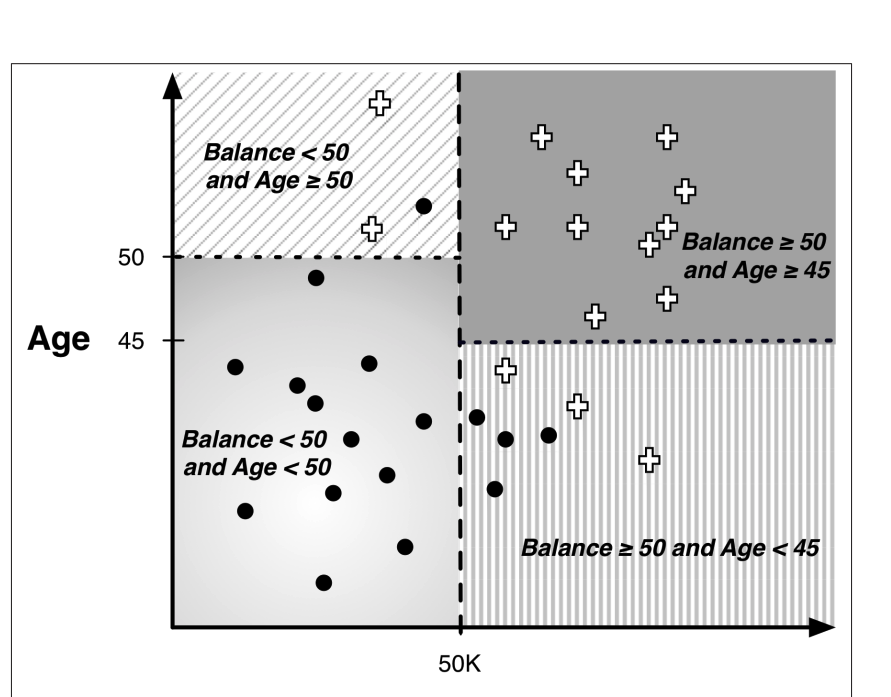

## Models, Induction, and Prediction

### Supervised Segmentation

- Khi chúng ta muốn phân chia khách hàng thành các nhóm dựa trên đặc điểm (attributes) của họ, mục tiêu là tạo ra các nhóm "thuần khiết" (pure) nhất có thể.
    - Nhóm thuần khiết nghĩa là trong cùng một nhóm, tất cả đều có cùng giá trị của biến mục tiêu (target variable). Ví dụ:
        - Nhóm 1: 100% khách hàng trả được nợ → Thuần khiết
        - Nhóm 2: 70% trả nợ, 30% không trả nợ → Không thuần khiết (impure)
-  khó khăn:
    - Rất hiếm có thuộc tính (attribute) nào chia dữ liệu ra được 100% thuần khiết.
    - Có trường hợp phân nhóm ra được nhóm rất thuần khiết, nhưng nhóm đó lại quá nhỏ (ví dụ chỉ có 1 khách hàng) → Không hiệu quả.
    - Một số thuộc tính có nhiều giá trị (như màu sắc, vị trí, nghề nghiệp) → Cần có cách xử lý phù hợp khi so sánh các thuộc tính này.
    - Với dữ liệu số (numeric data) → Không thể tạo nhóm cho từng giá trị một được → Phải tìm điểm cắt phù hợp.
- Người ta sử dụng công thức đo độ thuần khiết của nhóm, gọi là purity measure. Công thức phổ biến nhất là Information Gain (thu được thông tin) — dựa trên khái niệm Entropy.
    - Entropy là chỉ số đo mức độ hỗn loạn, không thuần khiết của một nhóm.
        - Entropy thấp → Nhóm gần như đồng nhất (rất thuần khiết).
        - Entropy = 0 → Nhóm thuần khiết hoàn toàn.
    - `Entropy = - p1 * log2(p1) - p2 * log2(p2) - ...`
    -   
- Entropy chỉ đo mức độ hỗn loạn hoặc độ thuần khiết của 1 tập dữ liệu (1 nhóm nhỏ), nhưng mục tiêu thật sự khi xây dựng mô hình là:
    - `Chọn thuộc tính (attribute) nào giúp phân chia dữ liệu ra các nhóm con càng "thuần khiết" càng tốt.`
    - dùng Information Gain (IG) để đo lường mức độ hữu ích của một thuộc tính trong việc phân chia dữ liệu.
    - `IG(parent, children) = Entropy(parent) - Σ [p(ci) * Entropy(ci)]`
        - Thuộc tính nào giúp giảm Entropy nhiều nhất → Là thuộc tính nên chọn đầu tiên để phân chia dữ liệu.
    - Tuy nhiên: IG cũng có nhược điểm!
        - Đó là nếu thuộc tính có quá nhiều giá trị khác nhau (ví dụ số CMND, số điện thoại...) → Thì chia xong có thể IG rất cao nhưng không có ý nghĩa dự đoán gì cả → Đây là vấn đề Overfitting (quá khớp dữ liệu huấn luyện) → Sẽ được giải thích kỹ hơn ở Chương 5.
- Nếu Bài Toán là Dự đoán số (Regression Problem) thì sao?
    - Khi biến mục tiêu (target variable) là một con số liên tục → Ví dụ: dự đoán giá nhà, thu nhập, thời gian, số lượng... → Ta không thể dùng Entropy hoặc Information Gain như bài toán phân loại (classification) được.
    - Dùng khái niệm Giảm Phương Sai (Variance Reduction).
        - Nếu tập dữ liệu con có giá trị target khá giống nhau → Phương sai (variance) sẽ nhỏ → Tập dữ liệu con đó được coi là "thuần khiết".
        - Ngược lại nếu giá trị target trong tập con phân tán nhiều → Variance lớn → Ít thuần khiết.
- Việc lựa chọn thuộc tính quan trọng (Attribute Selection) rất quan trọng trong Data Mining và Machine Learning:
    - Giúp hiểu rõ dữ liệu hơn.
    - Giúp chọn lọc các thuộc tính quan trọng nhất → Tăng tốc độ xử lý.
    - Giảm phức tạp mô hình (tránh overfitting).
    - Trong bài toán lớn có hàng trăm/thậm chí hàng ngàn thuộc tính → Việc lọc ra 10 hoặc 50 thuộc tính tốt nhất là rất quan trọng.
- Sau khi chọn được thuộc tính quan trọng (dựa trên Information Gain), ta không chỉ muốn phân chia dữ liệu dựa vào một thuộc tính, mà muốn kết hợp nhiều thuộc tính để phân đoạn dữ liệu (supervised segmentation).
- Tree-Structured Model (Cây quyết định).
    - Ta muốn phân chia tập dữ liệu thành nhiều nhóm (segment) dựa trên nhiều điều kiện.
    - Mỗi điều kiện là một thuộc tính (attribute) kiểm tra.
    - Từ đó xác định nhóm (hoặc dự đoán kết quả) cho từng đối tượng mới.
- Cấu trúc của Cây Quyết Định (Decision Tree)
    - Root Node
    - Internal Nodes
    - Branches
    - Leaf Node 
    - Characterics
        - Mỗi đối tượng chỉ đi được duy nhất 1 con đường từ Root Node tới 1 Leaf Node.
        - Tập dữ liệu ban đầu sẽ được chia thành nhiều Segment khác nhau.
        - Mỗi Segment là tập con có đặc điểm riêng.

### Visualizing Segmentations

- Không gian dữ liệu(space visualization) ở đây chính là không gian được mô tả bởi các đặc trưng (features) của dữ liệu
- Một cách trực quan phổ biến để hình dung không gian dữ liệu là biểu đồ phân tán (scatterplot), trong đó ta dùng 2 trục để biểu diễn mối quan hệ giữa 2 đặc trưng nào đó, nhằm phát hiện các xu hướng hay mối liên hệ giữa chúng.
- Các đường (hoặc mặt phẳng) dùng để phân chia các vùng dữ liệu đó được gọi là đường quyết định (decision lines) trong không gian 2 chiều, hoặc mặt phẳng quyết định (decision surfaces) trong không gian nhiều chiều

### Trees as Sets of Rules

- Nếu ta lần theo một đường đi từ nút gốc tới một nút lá và thu thập lại tất cả các điều kiện trên đường đi đó, ta sẽ tạo thành một "luật" (rule). Mỗi luật là sự kết hợp các điều kiện (attribute tests) bằng phép AND.

### Probability Estimation

- kỹ thuật xây dựng cây phân loại có thể dễ dàng mở rộng để dự đoán xác suất (gọi là cây ước lượng xác suất - probability estimation tree).
- Laplace Correction (hay còn gọi là Laplace Smoothing).
    - Giúp tránh trường hợp "ảo tưởng" xác suất 100% khi dữ liệu trong nút lá quá ít.
    - Nếu một nút lá chỉ có duy nhất 1 mẫu thuộc class c, tần suất (frequency-based) sẽ cho rằng xác suất = 100%. Nhưng điều đó rất nguy hiểm vì không có đủ dữ liệu để kết luận chắc chắn như vậy.
    - Laplace Correction "làm mềm" xác suất xuống, phản ánh sự không chắc chắn khi dữ liệu ít.