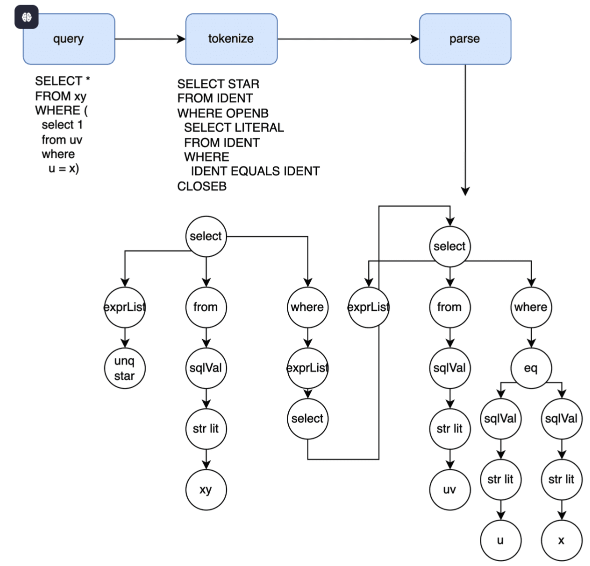

# Parsing

- The handler accumulates data until reaching a delimiter token (usually `;`)
  

# Binding

- Query parsing only partially checks if a query is well formed. Fields in the AST still need to be matched to symbols in the current database catalog, in addition to a host of other typing and clause-specific checks

# Plan Simplifications

Simplification regularizes SQL's rich syntax into a narrow format. Ideally all logically equivalent plans would funnel into one common shape. The "canonical" form should be the least surprising and fastest to execute. In practice, perfect simplification is an aspirational goal that has improved over time as workloads grow in complexity.

# Type Coercion

- The same expression's type varies depending on the calling context

# Plan Exploration

- A query plan's simplest form is often the fastest to execute. But joins, aggregations, and windows often have several equivalent variations whose performance is database dependent.

# Execution

- The final plan needs to be converted into an executable format.

# IO/Spooling

- Reading from storage and writing to network are conceptually similar even if at opposite ends of the query lifecycle. Data moves between storage, runtime, and wire-time formats the same way query plans move through different intermediate representations
